<div align="center">

**지식베이스 업데이트 뒤, 새로 품질이 떨어질 질문을 정답 라벨 없이 우선 탐지하는 RAG 평가 연구**


[핵심 결과](#핵심-결과) · [시스템 구조](#end-to-end-system) · [빠른 검증](#quick-verification) · [재현 문서](docs/REPRODUCIBILITY.md)

</div>

---

## 30초 요약

| 질문 | 답 |
|---|---|
| **문제** | 누적 뉴스 DB 업데이트 후 같은 RAG가 새롭게 틀리기 시작할 질문은 무엇인가? |
| **접근** | 이전·이후 답변 분포의 이동과 불확실성 변화를 2축 risk signal로 압축 |
| **평가** | T0에서만 학습·임계값 고정 후, 이후 4개 업데이트로 temporal transfer |
| **결과** | confirmatory cohort 186건에서 **AUROC 0.854 · F1 0.615 · Risk Lift 3.59×** |
| **공개 증거** | 실행 코드, 6개 테스트 모듈, frozen 결과표, 방법·한계·재현 문서 |

<table>
<tr>
<td width="25%" align="center"><h3>0.854</h3><sub>Confirmatory<br/>AUROC</sub></td>
<td width="25%" align="center"><h3>0.615</h3><sub>Confirmatory<br/>F1</sub></td>
<td width="25%" align="center"><h3>3.59×</h3><sub>Degradation<br/>Risk Lift</sub></td>
<td width="25%" align="center"><h3>4 Updates</h3><sub>Frozen Future<br/>Evaluation</sub></td>
</tr>
</table>

> 이 점수는 단일 답변의 절대 정답 여부가 아니라, **새로운 품질 저하 위험의 상대적 우선순위**를 평가합니다.

## Why this problem is hard

- 지식 업데이트는 검색 결과·답변 표현·정확도를 동시에 바꿉니다.
- 운영 시점에는 현재 질문의 gold answer가 바로 존재하지 않습니다.
- 같은 질문도 sampling에 따라 여러 답변 분포를 만듭니다.
- 한 시점에 맞춘 detector가 이후 업데이트에도 작동하는지 분리해서 검증해야 합니다.

그래서 “변화가 컸다”와 “실제로 새로 망가졌다”를 구분하고, detector를 미래 구간에서 다시 맞추지 않는 **frozen transfer protocol**을 사용했습니다.

## End-to-end system

```mermaid
flowchart LR
    A["CLARK questions<br/>validity spans"] --> B["Timestamped<br/>news linkage"]
    B --> C["Cumulative snapshots<br/>Kx → Ky"]
    C --> D["BM25 + BGE<br/>RRF retrieval"]
    D --> E["Fixed RAG agent<br/>16 samples / snapshot"]
    E --> F["Embedding + NLI<br/>semantic clusters"]
    F --> G["Shift + uncertainty<br/>risk features"]
    G --> H["T0-frozen<br/>quadratic logistic"]
    H --> I["Future risk ranking"]
    I --> J["P1–P5 diagnostic probe"]
```



## Detector design

이전 snapshot의 답변 집합 `Ax`와 업데이트 후 답변 집합 `Ay`에서 다음 신호를 계산합니다.

| 축 | 구성 신호 |
|---|---|
| **Distribution shift** | Sliced Wasserstein · RBF-MMD · Energy distance · semantic-cluster JS · centroid gap |
| **Uncertainty change** | semantic entropy 변화 · semantic volume 변화 |

각 신호를 T0 empirical percentile로 정규화하고, 두 축을 quadratic logistic model에 입력합니다. 모델과 operating threshold `0.784043`은 T0에서 고정되며 이후 4개 업데이트에서는 다시 학습하지 않습니다.

## 핵심 결과

| Evaluation cohort | N | New degradation | AUROC | AUPRC | Precision | Recall | F1 | Risk lift |
|---|---:|---:|---:|---:|---:|---:|---:|---:|
| **Future question-disjoint confirmatory** | 186 | 28 | **0.854** | 0.433 | 0.541 | **0.714** | **0.615** | **3.59×** |
| All future primary cases | 320 | 60 | 0.870 | 0.539 | 0.592 | 0.750 | 0.662 | 3.16× |

- detector는 미래 4개 update에 재적합하지 않았습니다.
- 구간별 성능 편차가 있으므로 CLARK 조건 밖의 보편적 성능을 주장하지 않습니다.
- 상세 결과: [docs/RESULTS.md](docs/RESULTS.md)
- 공개 집계표: [results/clark_t0/](results/clark_t0/)

## From detection to diagnosis

탐지된 역사적 실패를 더 강한 evidence 조건으로 순차 재생했습니다.

```text
P1  natural top-k
P2  guarantee current support is present
P3  move current support to rank 1
P4  decisive evidence only
P5  compact fact card
```

84개 질문 중 P1에서 실패한 18개 new-degradation case는 모두 P5까지 복구됐습니다. 최초 복구 단계는 coverage·ranking·context complexity·evidence utilization 중 어디를 우선 조사할지 제안하는 **진단 가설**이며, 확정적 인과 증명으로 해석하지 않습니다.

## What I built

- CLARK answer-validity span과 timestamped news를 연결하는 temporal data pipeline
- SQLite FTS5 BM25 + BGE dense retrieval + reciprocal-rank fusion
- snapshot당 16회 고정 RAG sampling과 semantic answer clustering
- 7개 분포·불확실성 신호와 T0-frozen detector
- question-disjoint confirmatory evaluation과 집계 리포트
- P1–P5 evidence intervention probe
- synthetic smoke fixture와 16개 unit test

## Repository map

```text
assets/                  portfolio hero artwork
configs/                 examples and archived experiment configs
data/                    setup guide + synthetic smoke fixture
docs/                    methods, results, limitations, reproduction
results/clark_t0/        frozen temporal-transfer tables
results/probe/           P1–P5 diagnostic tables
scripts/                 data, retrieval, detector and probe pipelines
src/                     shared generation, retrieval and metric modules
tests/                   focused CLARK and pipeline tests
```

## Quick verification

```powershell
python -m venv .venv
.\.venv\Scripts\python.exe -m pip install -r requirements.txt
.\.venv\Scripts\python.exe -m unittest discover -s tests -p "test_*.py"
.\.venv\Scripts\python.exe scripts\run_experiment.py --config configs\mini_temporal_mock.yaml
```

smoke run은 invented data, mock generation, hashing embedding, heuristic NLI를 사용합니다. 배선과 재현 절차만 검증하며 과학적 결과를 재현하는 실행은 아닙니다.

전체 CLARK 실행은 [재현 문서](docs/REPRODUCIBILITY.md)와 [데이터 파이프라인](docs/CLARK_DATA_PIPELINE.md)을 따릅니다.

## Evidence boundaries

- CLARK 원천 파일과 제3자 뉴스 기사는 재배포하지 않습니다.
- API 응답, 모델 가중치, local SQLite index는 공개하지 않습니다.
- confirmatory cohort 186건 중 positive event는 28건입니다.
- 미래 구간 하나는 다른 구간보다 성능이 유의하게 약합니다.
- risk score만으로 미래의 절대 정확도를 추정할 수 없습니다.
- P1–P5 복구 단계는 intervention-based diagnostic hypothesis입니다.

## Ownership & collaboration

연구 질문, temporal protocol, 평가 기준, 실험 의사결정, 실패 감사와 claim boundary를 직접 주도했습니다. Codex는 구현·디버깅·문서화 협업에 활용했고, 공개 결과는 테스트와 집계표로 검증 가능하게 구성했습니다.

**Deep dive** · [Methods](docs/METHODS.md) · [Results](docs/RESULTS.md) · [Limitations](docs/LIMITATIONS.md) · [한국어 요약](docs/PORTFOLIO_SUMMARY_KO.md)
