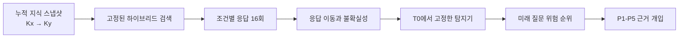

<div align="center">

**지식베이스가 바뀐 직후, 정답 라벨 없이 위험 질문을 선별하고 원인 조사 순서를 좁힙니다.**


</div>

## 문제

RAG의 지식베이스를 업데이트하면 일부 질문은 더 잘 풀리지만, 이전에는 맞히던 질문이 새롭게 틀릴 수도 있습니다. 연구 환경에서는 최신 정답을 만들어 전후 정확도를 비교할 수 있습니다. 운영 환경에서는 업데이트할 때마다 모든 질문의 정답을 다시 만드는 일이 현실적이지 않습니다.

이 프로젝트는 정답이 아직 없는 시점에 RAG의 응답 변화만 보고 검토할 질문의 순서를 정합니다. 위험 신호가 잡힌 질문에는 근거 문서를 단계적으로 바꾸는 실험을 적용해 검색, 순위와 문맥 구성, 근거 활용 중 어디부터 살펴볼지도 좁힙니다.

## 설계



### 시간 순서를 지키는 평가

CLARK의 질문별 유효 시점과 뉴스 근거를 이용해 과거 상태 `Kx`와 업데이트 이후 상태 `Ky`를 만들었습니다. 새 문서가 들어올 때 기존 문서를 지우지 않고 누적해 실제 지식베이스 업데이트에 가까운 조건을 구성했습니다. 검색기는 SQLite FTS5 BM25와 BGE dense retrieval을 reciprocal-rank fusion으로 결합하고 전 구간에서 고정했습니다.

탐지기와 임계값은 초기 구간 T0에서만 정했습니다. 이후 네 구간에는 다시 맞추지 않았고, T0에 없던 질문만 평가에 사용했습니다. 미래 라벨을 보고 기준을 조정하는 누수를 막기 위한 설계입니다.

### 한 번의 답이 아닌 응답 분포

같은 질문도 생성할 때마다 표현과 결론이 달라질 수 있어 조건별로 16개 응답을 수집했습니다. 임베딩 거리와 NLI 군집을 이용해 응답 분포의 이동을 측정하고, 의미 엔트로피와 분포 부피로 불확실성 변화를 따로 계산했습니다. 서로 단위가 다른 지표는 T0의 경험적 백분위로 바꿔 비교했습니다.

초기에는 이동과 불확실성을 높고 낮음으로 나눈 단순 규칙을 시도했습니다. 하지만 최신 정보에 적응하지 못한 채 확신하는 실패와, 정상적으로 답이 바뀐 경우를 구분하기 어려웠습니다. 최종 탐지기는 두 축의 상호작용과 곡률을 반영하는 quadratic logistic으로 고정했습니다.

### 탐지 이후의 조사

위험 점수만으로는 실패가 시작된 위치를 알 수 없습니다. 그래서 최신 근거의 포함 여부, 검색 순위, 주변 문맥을 P1부터 P5까지 한 단계씩 바꾸고 처음 복구되는 조건을 기록했습니다. 이 값은 확정 원인이 아니라 엔지니어가 먼저 확인할 구간을 정하는 진단 단서입니다.

세부 지표와 실험 설정은 [Methods](docs/METHODS.md)에 정리했습니다.

## 결과

주요 평가는 T0 이후 처음 등장한 질문 186건으로 구성했습니다.

| 평가 집합 | 질문 | 새 성능 저하 | AUROC | Recall | F1 | Risk lift |
|---|---:|---:|---:|---:|---:|---:|
| Future question-disjoint | 186 | 28 | **0.854** | **0.714** | **0.615** | **3.59×** |

탐지기가 고른 검토 집합에는 새 성능 저하 사례가 전체 발생률보다 3.59배 많이 모였습니다. 모든 오류를 자동 판정하는 용도가 아니라, 같은 검토 인력으로 위험 사례를 먼저 확인하기 위한 결과입니다. 업데이트 구간별 편차는 남았고 가장 약한 구간의 AUROC는 `0.658`이었습니다.

근거 개입 실험은 별도로 고정한 과거 실패 22건에서 진행했습니다. 자연 검색 조건 P1에서 다시 실패한 18건은 압축된 사실 카드를 준 P5까지 모두 복구됐습니다. 이 22건과 위 표의 새 성능 저하 28건은 서로 다른 평가 집합입니다. 전체 결과와 신뢰구간은 [Results](docs/RESULTS.md)에서 확인할 수 있습니다.

## 실행

```powershell
python -m venv .venv
.\.venv\Scripts\python.exe -m pip install -r requirements.txt
.\.venv\Scripts\python.exe -m unittest discover -s tests -p "test_*.py"
.\.venv\Scripts\python.exe scripts\run_experiment.py --config configs\mini_temporal_mock.yaml
```

위 명령은 합성 데이터로 실행 경로를 확인합니다. CLARK 실험 전체를 재현하려면 라이선스가 허용된 원천 데이터와 외부 모델 또는 API가 필요합니다. 자세한 순서는 [Reproducibility](docs/REPRODUCIBILITY.md)에 있습니다.

## 한계

- 위험 점수는 개별 답변이 틀릴 확률이 아닙니다.
- CLARK에서 얻은 결과가 다른 데이터, 모델과 검색기에서도 유지된다고 볼 수 없습니다.
- 근거 개입에서 처음 복구된 단계는 인과적으로 증명한 원인이 아닙니다.
- 원천 기사와 모델 가중치, API 응답, 로컬 인덱스는 저장소에 포함하지 않습니다.

## 작업 범위

개인 연구 프로젝트로 연구 질문, 시간축 평가 프로토콜, 탐지기, 근거 개입 실험과 결과 해석을 설계했습니다. 구현과 테스트를 반복하는 과정에는 Codex를 사용했으며, 저장소에는 실행 코드와 검증된 집계 결과를 함께 공개했습니다.

[Methods](docs/METHODS.md) · [Results](docs/RESULTS.md) · [Limitations](docs/LIMITATIONS.md) · [Data pipeline](docs/CLARK_DATA_PIPELINE.md)
