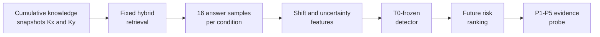

<div align="center">

**DB 업데이트 이후 새롭게 실패했을 가능성이 높은 RAG 질문을 라벨 없이 탐지하고, evidence intervention으로 조사할 구간을 좁히는 평가 프레임워크**


[핵심 요약](#핵심-요약) · [탐지 검증](#탐지-검증) · [진단 프로브](#탐지-후-진단) · [빠른 검증](#구현과-재현) · [재현 문서](docs/REPRODUCIBILITY.md)

</div>

---

## 프로젝트 맥락

| 구분 | 내용 |
|---|---|
| 작업 형태 | 개인 연구 프로젝트 |
| 담당 | 연구 질문, temporal protocol, failure detector, intervention probe, 평가와 결과 해석 |
| 구현 방식 | Codex를 활용한 코드 작성·수정과 반복 검증 |
| 공개 범위 | 실행 코드, 테스트, 핵심 집계 결과와 재현 문서 |

저장소 이름에는 연구 초기에 사용한 `temporal-rag-drift`를 유지했습니다. 포트폴리오에서는 수행한 작업이 바로 드러나도록 **Temporal RAG Failure Detection**으로 표시합니다.

## 핵심 요약

| 구분 | 내용 |
|---|---|
| 운영 문제 | DB 업데이트 직후에는 최신 gold answer가 없어 어떤 질문부터 다시 확인해야 할지 알기 어렵습니다. |
| 구현 | 업데이트 전후 답변 분포와 불확실성의 변화를 이용해 위험 질문의 순위를 만들고, evidence intervention으로 조사할 구간을 좁혔습니다. |
| 핵심 결과 | 미래 질문 186건 중 새 저하 28건을 평가했을 때 AUROC `0.854`, Recall `0.714`, F1 `0.615`를 기록했습니다. |
| 운영 해석 | Detector가 고른 검토 집합에는 새 저하 사례가 전체 발생률 대비 `3.59배` 더 밀집했습니다. 오류를 확정하는 대신 검토 예산을 위험 질문에 먼저 쓰는 용도입니다. |
| 한계 | 가장 약한 업데이트 구간의 AUROC는 `0.658`이었으며, risk score와 probe 결과를 오류 확률이나 확정 원인으로 해석할 수는 없습니다. |

## 운영 제약

Temporal RAG 연구에서는 시간에 따라 달라진 gold answer로 업데이트 전후 성능을 사후 평가할 수 있습니다. 실제 운영에서는 DB를 업데이트할 때마다 모든 질문의 최신 정답을 즉시 다시 만들기 어렵습니다. 새 정보가 추가된 직후에는 전체 정확도를 계산할 수 없고, 어떤 질문부터 확인해야 하는지도 알기 어렵습니다.

## 연구 질문

> Gold answer가 아직 없는 업데이트 직후, RAG의 행동 변화만으로 새롭게 실패했을 가능성이 높은 질문을 탐지할 수 있는가?

탐지에서 끝내지 않고 두 번째 질문도 다뤘습니다.

> 위험 질문에 evidence intervention을 적용하면 retrieval, ranking과 context 구성, evidence utilization 중 먼저 조사할 구간을 좁힐 수 있는가?

Gold answer는 detector 입력으로 사용하지 않았습니다. T0에서 detector를 만들고 미래 DB 구간에 고정 적용한 뒤, gold answer는 탐지 결과를 사후 평가하는 데만 사용했습니다.

## 가설이 바뀐 과정

처음에는 harmful update라면 answer shift와 uncertainty가 모두 높을 것으로 예상했습니다. 그러나 evolving knowledge에서는 uncertainty가 낮은데도 최신 정보에 적응하지 못한 confident failure가 있었고, 정상적으로 답이 바뀐 경우에도 shift가 크게 나타났습니다. 두 값을 각각 낮음과 높음으로 나눈 사분면 규칙만으로는 두 경우를 안정적으로 구분하지 못했습니다.

여러 shift·uncertainty feature와 classifier를 비교한 뒤, 최종 confirmatory 경로에서는 T0의 두 축과 상호작용을 학습한 quadratic logistic을 고정했습니다. Absolute future accuracy를 직접 예측하는 회귀도 시도했지만 future `R²`가 약 `0.078`에 그쳤습니다. 그래서 이 프로젝트의 목표를 정답 확률 예측이 아니라, DB 업데이트 뒤 새롭게 성능이 저하될 질문의 검토 순위를 정하는 문제로 좁혔습니다.

## 방법과 설계 선택

같은 질문을 업데이트 전후에 반복 실행하고, 답변 하나의 정오 대신 답변 분포와 불확실성이 어떻게 달라졌는지 비교했습니다. Detector가 위험하다고 본 질문에는 P1-P5 evidence intervention을 적용했습니다.



| 설계 선택 | 이유와 해석 범위 |
|---|---|
| CLARK 누적 snapshot | 질문별 유효 시점과 외부 뉴스 근거를 이용해 기존 문서는 남고 새 근거가 쌓이는 DB 업데이트를 모사했습니다. 실제 서비스 요청을 그대로 재현한 것은 아니므로 결과는 이 시간축 실험에 한정합니다. |
| 조건별 답변 16회 생성 | 한 번의 생성 결과에 좌우되지 않도록 embedding과 NLI로 답변을 묶고, 분포 이동과 의미적 불확실성을 측정했습니다. |
| Shift와 uncertainty 분리 | SWD, RBF-MMD, Energy distance, semantic-cluster JS, centroid gap으로 변화의 모양을 보고, semantic entropy와 volume으로 답변의 흔들림을 봤습니다. 단위가 다른 지표는 T0 경험적 percentile로 바꿔 비교했습니다. |
| Quadratic logistic | 두 축의 상호작용과 곡률을 표현하면서도 점수가 높아진 조합을 확인할 수 있는 모델을 택했습니다. Class imbalance에는 balanced weight를 적용했고, model family와 hyperparameter는 T0 안에서만 정했습니다. |
| T0-frozen 평가 | 미래 label을 보고 기준을 다시 맞추지 않도록 detector와 threshold를 T0에서 고정하고 이후 네 구간에 그대로 적용했습니다. |

- retrieval: SQLite FTS5 BM25와 BGE dense retrieval을 reciprocal-rank fusion으로 결합
- monitoring signal: SWD, RBF-MMD, Energy distance, semantic-cluster JS, centroid gap, semantic entropy와 volume 변화
- evaluation: T0에서 detector와 threshold를 고정한 뒤 질문이 겹치지 않는 미래 업데이트에 적용
- diagnosis: evidence 제공 조건만 단계적으로 바꿔 최초 복구 지점을 기록

세부 정의와 실험 설정은 [Methods](docs/METHODS.md)에 정리했습니다.

## 탐지 검증

주요 주장은 T0 이후 처음 등장한 질문 186건으로 구성한 confirmatory cohort 결과입니다. Detector와 threshold는 미래 구간에서 다시 맞추지 않았습니다.

| Cohort | N | New degradation | AUROC | Recall | F1 | Risk lift |
|---|---:|---:|---:|---:|---:|---:|
| **Future question-disjoint confirmatory** | 186 | 28 | **0.854** | **0.714** | **0.615** | **3.59×** |

Risk lift `3.59배`는 detector가 고른 검토 집합의 새 저하 비율이 같은 cohort 전체 발생률보다 그만큼 높았다는 뜻입니다. 이는 완전한 오류 판정기가 아니라 검토 우선순위를 만드는 결과입니다. 업데이트 구간별 편차가 있었고, 가장 약한 구간의 AUROC는 `0.658`이었습니다. 전체 표와 bootstrap interval은 [Results](docs/RESULTS.md)에서 확인할 수 있습니다.

## 탐지 후 진단

탐지된 과거 실패를 같은 질문과 sampling 조건에서 다시 실행하고 evidence 전달만 바꿨습니다.

```text
P1  natural top-k
P2  guarantee current support is present
P3  move current support to rank 1
P4  decisive evidence only
P5  compact fact card
```

탐지 성능을 평가한 confirmatory cohort의 28건과 이 probe의 22건은 같은 표본이 아닙니다. Probe는 evidence 조건을 바꿔가며 다시 실행할 수 있도록 별도로 고정한 과거 failure cohort입니다. 이 22건 중 P1에서 다시 실패한 18건은 P5까지 모두 복구됐습니다. 최초 복구 단계는 확정 원인이 아니라 다음 조사 대상을 정하는 진단 가설입니다.

Risk score만으로는 "왜 위험한가"를 알 수 없기 때문에 probe를 추가했습니다. 최신 근거를 넣고, 순위를 올리고, 주변 문맥을 제거하는 식으로 한 조건씩 바꾸면 운영자가 retriever, ranking, context 구성과 generator 중 어디부터 확인할지 정할 수 있습니다.

## 구현과 재현

- temporal data linkage와 cumulative snapshot 생성
- hybrid retrieval과 고정 sampling
- 분포·불확실성 feature와 frozen detector
- question-disjoint evaluation, aggregate report와 P1-P5 probe
- synthetic smoke fixture와 16개 unit test

```powershell
python -m venv .venv
.\.venv\Scripts\python.exe -m pip install -r requirements.txt
.\.venv\Scripts\python.exe -m unittest discover -s tests -p "test_*.py"
.\.venv\Scripts\python.exe scripts\run_experiment.py --config configs\mini_temporal_mock.yaml
```

Smoke run은 배선과 실행 절차만 확인합니다. CLARK 실험을 다시 실행하려면 라이선스가 허용된 원천 데이터와 외부 모델·API가 필요합니다. 전체 순서는 [Reproducibility](docs/REPRODUCIBILITY.md)와 [Data pipeline](docs/CLARK_DATA_PIPELINE.md)에 있습니다.

## 해석 범위

- risk score는 개별 답변의 정답 확률이 아닙니다.
- CLARK 밖의 데이터셋, 모델, prompt와 retriever로 일반화된다고 주장하지 않습니다.
- probe의 최초 복구 단계는 인과적으로 증명된 root cause가 아닙니다.
- CLARK 원천 파일, 기사 본문, API 응답, 모델 가중치와 local index는 공개하지 않습니다.

## 기여

연구 질문, 가설, temporal protocol, 평가 기준, detector, failure probe와 결과 해석 범위를 설계했습니다. Codex를 활용해 실험 코드와 테스트를 반복 수정·검증했고, 공개 저장소에는 실행 코드와 핵심 집계표를 함께 두었습니다.

[Methods](docs/METHODS.md) · [Results](docs/RESULTS.md) · [Limitations](docs/LIMITATIONS.md) · [Reproducibility](docs/REPRODUCIBILITY.md)
