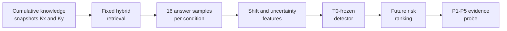

<div align="center">

**DB 업데이트 이후 새로 위험해진 RAG 질문을 라벨 없이 우선순위화하고, evidence intervention으로 조사할 실패 구간을 좁히는 평가 프레임워크**


[핵심 결과](#핵심-결과) · [진단 프로브](#탐지-후-진단) · [빠른 검증](#빠른-검증) · [재현 문서](docs/REPRODUCIBILITY.md)

</div>

---

## 문제

RAG의 지식베이스가 업데이트되면 새 정보를 답할 수 있지만, 기존 질문의 검색 결과와 문맥도 함께 바뀝니다. 운영 시점에는 현재 질문의 정답 라벨이 바로 없기 때문에 업데이트가 실제 성능 저하를 만들었는지 즉시 확인하기 어렵습니다.

이 프로젝트는 업데이트 전후의 답변 분포와 불확실성 변화를 이용해 검토할 질문의 우선순위를 정합니다. 위험 사례에는 P1-P5 evidence intervention을 적용해 retrieval coverage, ranking, context complexity와 evidence utilization 중 어디를 먼저 조사할지 제안합니다.

## 설계 의도

### 왜 CLARK를 사용했는가

실제 서비스 DB를 그대로 공개하거나 과거 상태로 되돌려 반복 실험하기는 어렵습니다. CLARK에는 질문별로 정답이 유효한 시점과 외부 뉴스 근거가 연결되어 있어, 과거 시점 `Kx`와 누적 업데이트 이후 `Ky`를 같은 규칙으로 구성할 수 있습니다. 이를 이용해 "오래된 문서가 사라지고 새 문서로 교체되는 상황"이 아니라, 운영 DB처럼 기존 문서를 유지한 채 새 근거가 쌓이는 상황을 모사했습니다.

CLARK는 실제 서비스 요청을 그대로 재현한 데이터가 아니라, 시간에 따른 지식 변화를 통제해 볼 수 있는 대리 환경입니다. 따라서 결과는 CLARK에서 구성한 시간축 실험으로 한정하며, 다른 도메인에서도 같은 성능이 나온다고 해석하지 않습니다.

### 왜 답변 하나가 아니라 분포를 비교했는가

같은 질문도 생성 과정에 따라 표현과 결론이 달라질 수 있습니다. 한 번의 정답 여부만 비교하면 우연한 결과에 민감해지므로 질문과 snapshot마다 답변을 16회 생성했습니다. 답변들을 embedding과 NLI로 묶어 분포 이동과 의미적 불확실성 변화를 감지 신호로 사용했습니다.

### 왜 여러 shift 지표와 uncertainty를 분리했는가

분포 변화는 한 가지 모양으로만 나타나지 않습니다. 답변 군집의 위치가 움직일 수도 있고, 일부 답변만 멀어지거나 의미 군집의 비율이 달라질 수도 있습니다. SWD, RBF-MMD, Energy distance, semantic-cluster JS와 centroid gap을 함께 사용한 이유입니다. 반면 semantic entropy와 volume은 답변이 얼마나 흔들리는지를 나타냅니다. 무엇이 달라졌는지와 얼마나 불안정해졌는지를 구분하기 위해 shift와 uncertainty를 두 축으로 나눴습니다.

지표마다 값의 범위가 달라 raw value를 바로 평균내면 단위가 큰 지표가 결과를 좌우할 수 있습니다. 각 지표를 T0 기준의 경험적 percentile로 바꾼 뒤 같은 비중으로 결합해, "평소보다 얼마나 이례적인가"라는 공통 기준으로 맞췄습니다.

### 왜 quadratic logistic을 사용했는가

위험이 shift나 uncertainty 하나에만 비례한다고 가정하지 않았습니다. 두 값이 함께 높을 때 위험이 커지는 상호작용과 완만한 곡률을 표현하면서도, 복잡한 black-box model보다 어떤 조합에서 점수가 높아졌는지 확인하기 쉬운 quadratic logistic을 선택했습니다. Class imbalance는 balanced weight로 처리하고, model family와 hyperparameter는 T0 안에서만 결정했습니다.

### 왜 detector를 T0에서 고정했는가

업데이트가 생길 때마다 미래 label로 threshold를 다시 맞추면 운영 시점의 성능을 과대평가할 수 있습니다. T0에서 detector와 threshold를 정한 뒤 이후 네 구간에는 그대로 적용해, 처음 정한 기준이 새로운 질문과 DB 상태에서도 유지되는지 확인했습니다.

## 방법



- retrieval: SQLite FTS5 BM25와 BGE dense retrieval을 reciprocal-rank fusion으로 결합
- monitoring signal: SWD, RBF-MMD, Energy distance, semantic-cluster JS, centroid gap, semantic entropy와 volume 변화
- evaluation: T0에서 detector와 threshold를 고정한 뒤 질문이 겹치지 않는 미래 업데이트에 적용
- diagnosis: evidence 제공 조건만 단계적으로 바꿔 최초 복구 지점을 기록

세부 정의와 실험 설정은 [Methods](docs/METHODS.md)에 정리했습니다.

## 핵심 결과

주요 주장은 T0 이후 처음 등장한 질문 186건으로 구성한 confirmatory cohort 결과입니다. Detector와 threshold는 미래 구간에서 다시 맞추지 않았습니다.

| Cohort | N | New degradation | AUROC | Recall | F1 | Risk lift |
|---|---:|---:|---:|---:|---:|---:|
| **Future question-disjoint confirmatory** | 186 | 28 | **0.854** | **0.714** | **0.615** | **3.59×** |

이는 완전한 오류 판정기가 아니라 검토 우선순위를 만드는 결과입니다. 업데이트 구간별 편차가 있었고, 가장 약한 구간의 AUROC는 `0.658`이었습니다. 전체 표와 bootstrap interval은 [Results](docs/RESULTS.md)에서 확인할 수 있습니다.

## 탐지 후 진단

탐지된 과거 실패를 같은 질문과 sampling 조건에서 다시 실행하고 evidence 전달만 바꿨습니다.

```text
P1  natural top-k
P2  guarantee current support is present
P3  move current support to rank 1
P4  decisive evidence only
P5  compact fact card
```

New-degradation 22건 중 P1에서 다시 실패한 18건은 P5까지 모두 복구됐습니다. 최초 복구 단계는 확정 원인이 아니라 다음 조사 대상을 정하는 진단 가설입니다.

Risk score만으로는 "왜 위험한가"를 알 수 없기 때문에 probe를 추가했습니다. 최신 근거를 넣고, 순위를 올리고, 주변 문맥을 제거하는 식으로 한 조건씩 바꾸면 운영자가 retriever, ranking, context 구성과 generator 중 어디부터 확인할지 정할 수 있습니다.

## 구현과 재현

- temporal data linkage와 cumulative snapshot 생성
- hybrid retrieval과 고정 sampling
- 분포·불확실성 feature와 frozen detector
- question-disjoint evaluation, aggregate report와 P1-P5 probe
- synthetic smoke fixture와 16개 unit test

```powershell
python -m venv .venv
.\.venv\Scripts\python.exe -m pip install -r requirements.txt
.\.venv\Scripts\python.exe -m unittest discover -s tests -p "test_*.py"
.\.venv\Scripts\python.exe scripts\run_experiment.py --config configs\mini_temporal_mock.yaml
```

Smoke run은 배선과 실행 절차만 확인합니다. CLARK 실험을 다시 실행하려면 라이선스가 허용된 원천 데이터와 외부 모델·API가 필요합니다. 전체 순서는 [Reproducibility](docs/REPRODUCIBILITY.md)와 [Data pipeline](docs/CLARK_DATA_PIPELINE.md)에 있습니다.

## 해석 범위

- risk score는 개별 답변의 정답 확률이 아닙니다.
- CLARK 밖의 데이터셋, 모델, prompt와 retriever로 일반화된다고 주장하지 않습니다.
- probe의 최초 복구 단계는 인과적으로 증명된 root cause가 아닙니다.
- CLARK 원천 파일, 기사 본문, API 응답, 모델 가중치와 local index는 공개하지 않습니다.

## 기여

연구 질문, temporal protocol, 평가 기준, detector, failure probe, 결과 감사와 해석 범위를 설계했습니다. 공개 저장소에는 실행 코드, 테스트와 핵심 집계표를 함께 두었습니다.

[Methods](docs/METHODS.md) · [Results](docs/RESULTS.md) · [Limitations](docs/LIMITATIONS.md) · [Reproducibility](docs/REPRODUCIBILITY.md)
