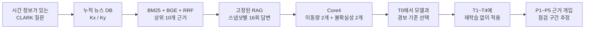
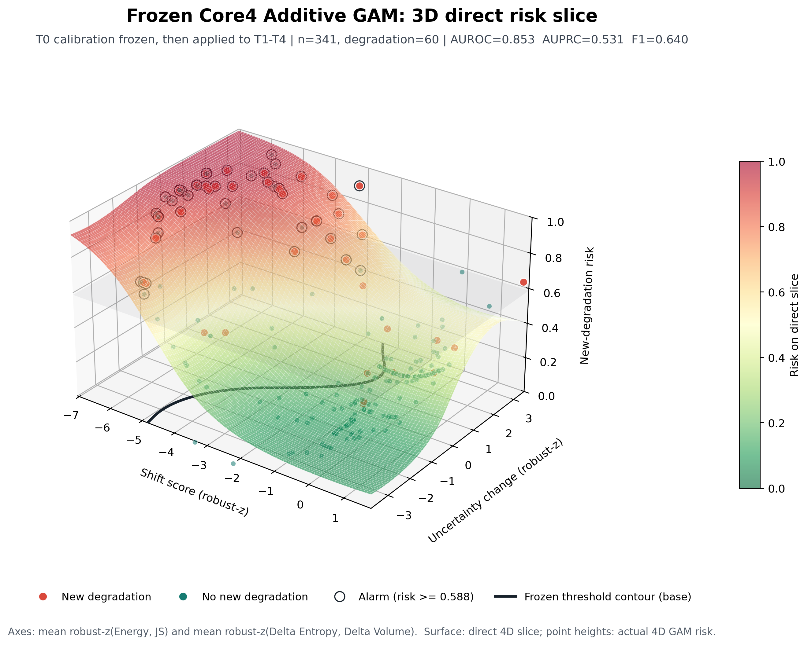
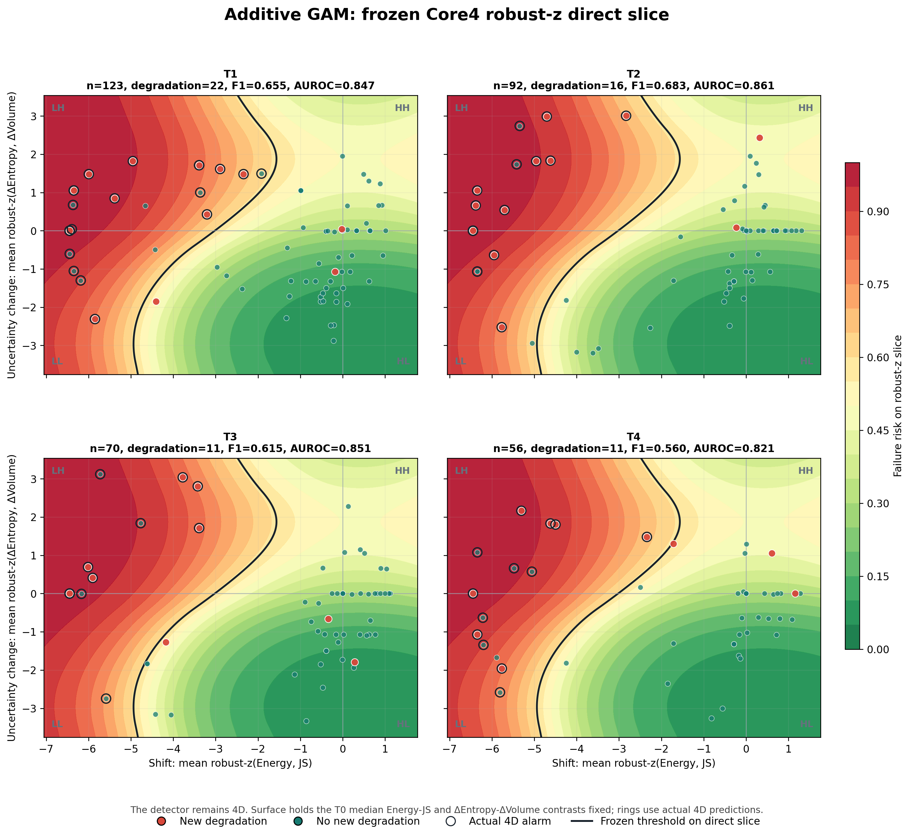
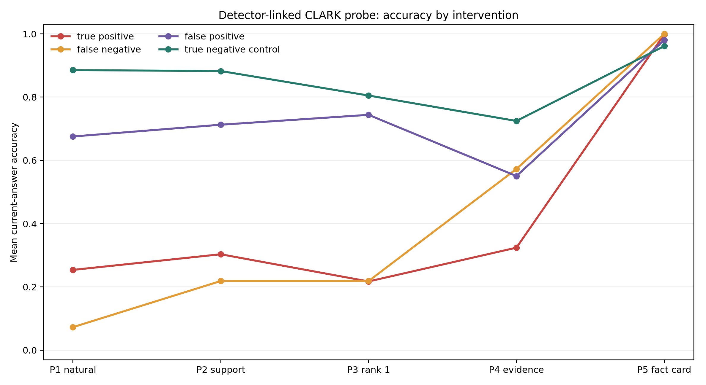
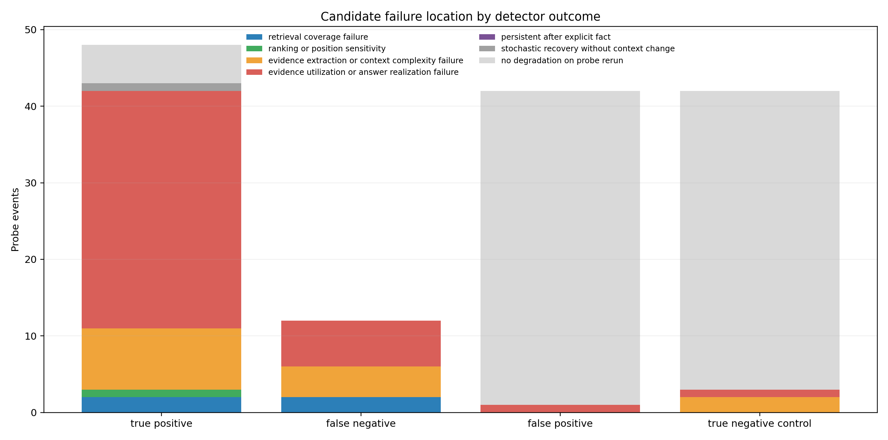

<div align="center">

[한국어](README.md) | [English](README_EN.md)

# DB 업데이트 뒤 위험해진 RAG 질문 찾기

**Temporal RAG Failure Detection**

지식 DB가 바뀐 직후 최신 정답지가 없어도, 답변 분포의 변화를 이용해 성능 저하 위험이 큰 질문을 먼저 찾고 점검할 구간을 좁힙니다.


[문제](#왜-이-문제를-다뤘나) · [방법](#탐지기를-만든-방법) · [결과](#미래-업데이트-평가) · [실행](#빠르게-확인하기)

</div>

## 왜 이 문제를 다뤘나

뉴스, 정책, 규정처럼 시간이 지나며 바뀌는 지식을 다루는 RAG는 DB가 업데이트된 뒤에 성능이 달라질 수 있습니다. 하지만 실제 운영에서는 DB가 바뀔 때마다 모든 질문의 최신 정답을 다시 만들기 어렵습니다. 정답지가 없는 시점에 어떤 질문부터 확인할지 정하는 방법이 필요합니다.

이 프로젝트는 같은 질문을 업데이트 전후의 RAG에 반복해 물었을 때 나타나는 답변 분포의 변화를 사용합니다. 미래 시점의 정답 라벨은 탐지기에 넣지 않습니다. 탐지 결과는 답변의 정오를 보증하는 값이 아니라, 업데이트 뒤 상대적으로 위험해진 질문의 검수 순서입니다.

## 30초 요약

- CLARK의 시간 정보가 있는 질문과 뉴스 근거를 누적 DB 스냅샷으로 재구성했습니다.
- 첫 업데이트에서만 모델, 정규화와 경보 기준을 정하고 이후 네 번의 업데이트에는 다시 맞추지 않았습니다.
- 답변의 이동량과 불확실성 변화 4개를 입력으로 사용한 Core4 탐지기를 비교했습니다.
- 위험 사례를 찾은 뒤에는 근거를 단계적으로 바꾸는 개입 실험으로 검색, 순위, 문맥 복잡도, 근거 활용 문제를 나눠 살폈습니다.

## 탐지기를 만든 방법



### 답변 변화를 수치로 바꾸기

스냅샷마다 같은 질문에 16개의 답변을 생성했습니다. 한 번의 답변이 아니라 답변 집합이 어떻게 움직였는지를 네 가지 값으로 계산했습니다.

```text
이동량(Shift)       = Energy distance + 의미 군집 JS divergence
불확실성 변화       = 의미 엔트로피 변화 + 의미 부피 변화
```

처음에는 이동량과 불확실성을 높고 낮음으로 나눈 단순 규칙을 생각했습니다. 실제 데이터에서는 크게 이동했지만 한쪽 답으로 모여 불확실성이 낮은 사례도 중요했습니다. 그래서 네 값을 그대로 사용하고, 첫 업데이트에서 여러 분류기를 비교하는 방식으로 바꿨습니다.

### 고정한 실험 조건

| 항목 | 설정 |
|---|---|
| 데이터 | CLARK 자연어 시간 질의와 정답 유효 기간 |
| DB 스냅샷 | 해당 시점까지 발행된 뉴스 기사 누적 |
| 검색 | SQLite FTS5 BM25 + `BAAI/bge-large-en-v1.5` + RRF |
| 답변 생성 | `gpt-5.6-luna`, temperature 0.8, top-p 0.95, 조건별 16회 |
| 의미 분석 | BGE 답변 임베딩 + `microsoft/deberta-large-mnli` 군집화 |
| 성능 저하 정의 | 업데이트 뒤 정확도가 0.10 이상 하락한 사례. 두 시점 모두 실패한 사례는 양성에서 제외 |

## 미래 업데이트 평가

모델 종류, 표현 방식, 하이퍼파라미터와 경보 기준은 첫 업데이트 `T0`만 보고 정했습니다. 이후 네 업데이트에는 다시 학습하거나 경보 기준을 조정하지 않았습니다.

| 구간 | DB 업데이트 | 사례 수 | 새 성능 저하 |
|---|---|---:|---:|
| T0 선택 구간 | 2021-12-22 → 2022-08-31 | 167 | 24 |
| T1 평가 | 2022-08-31 → 2023-01-29 | 123 | 22 |
| T2 평가 | 2023-01-29 → 2023-07-31 | 92 | 16 |
| T3 평가 | 2023-07-31 → 2023-11-21 | 70 | 11 |
| T4 평가 | 2023-11-21 → 2024-04-19 | 56 | 11 |

T1부터 T4까지의 341건과 성능 저하 60건을 합쳐 고정 전이 성능을 확인했습니다.

| 모델 | T0에서 선택된 정규화 | 미래 AUROC | AUPRC | 재현율 | F1 | 위험도 향상 |
|---|---|---:|---:|---:|---:|---:|
| L2 로지스틱 | robust-z | **0.883** | 0.617 | 0.833 | 0.645 | 2.99배 |
| 2차 로지스틱 | robust-z | 0.860 | 0.558 | 0.817 | **0.649** | 3.06배 |
| Additive GAM | robust-z | 0.853 | 0.531 | 0.800 | 0.640 | **3.03배** |
| Extra Trees | robust-z | 0.867 | 0.534 | 0.783 | 0.631 | 3.00배 |
| RBF-SVM | ECDF | 0.865 | **0.664** | 0.733 | 0.599 | 2.87배 |

T0의 F1 기준으로 정한 공식 선택 모델은 Extra Trees입니다. 미래 구간에서는 L2 로지스틱의 AUROC와 2차 로지스틱의 F1이 가장 높았습니다. 다만 상위 모델의 군집 부트스트랩 구간이 겹쳤기 때문에 한 모델이 항상 낫다고 해석하지 않았습니다. 아래 진단 실험에는 탐지 표면을 살펴볼 수 있고 전이 성능도 비슷한 Additive GAM을 사후 선택해 사용했습니다.



3차원 표면은 4차원 GAM을 2개의 해석 축으로 보인 직접 단면입니다. 이동량 축은
robust-z Energy와 JS를, 불확실성 변화 축은 robust-z 엔트로피 변화와 부피
변화를 같이 움직입니다. 색 표면은 T0의 변수 쌍 내 중앙 차이를 고정해 계산했고,
점의 높이는 각 질문의 실제 4차원 GAM 위험 확률입니다.



구간별 그림의 빨간 점은 새 성능 저하, 청록색 점은 그 밖의 사례,
검은 테두리는 실제 4차원 경보를 뜻합니다. [L2 로지스틱](assets/clark_core4_l2_robust_z_transfer.png)과
[2차 로지스틱](assets/clark_core4_quadratic_robust_z_transfer.png) 단면도 함께 공개했습니다.

## 탐지 뒤에 무엇을 확인할까

Additive GAM은 미래 341건 가운데 실제 성능 저하 60건 중 48건을 경보로 잡았습니다. 탐지에서 끝내지 않고, 양성 60건과 거짓 경보 42건, 크기를 맞춘 정상 대조군 42건을 다시 실행했습니다. 총 144건에서 11,520개의 답변을 생성했습니다.

| 단계 | 근거를 바꾼 방법 | 이 단계에서 회복할 때 먼저 의심할 부분 |
|---|---|---|
| P1 | 원래 검색 결과 | 기준 상태 |
| P2 | 최신 정답 근거가 상위 10개 안에 들도록 보장 | 검색 범위 |
| P3 | 최신 정답 근거를 1순위로 이동 | 순위와 위치 |
| P4 | 결정적인 근거만 제공 | 정보 추출 또는 복잡한 문맥 |
| P5 | 현재 사실을 짧은 카드로 제공 | 근거 활용과 답변 생성 |



실제 성능 저하 60건 중 48건이 경보에 걸렸습니다. 이 가운데 5건은 P1에서 실패가 다시 나타나지 않았고, 나머지 43건은 경보에 걸린 뒤 어느 단계에서든 회복했습니다. P5에는 현재 정답 사실이 직접 들어가므로 `43/60`, 71.7%는 진단 가능성의 상한으로 해석했습니다. 운영 환경의 위치 추정률로 사용할 수는 없습니다. P5 이전의 P2부터 P4에서 회복한 사례는 11건이었습니다.



최신 정답 근거가 원래 검색 상위 10개에 있었던 양성 사례가 60건 중 52건이었지만, 재현된 성능 저하는 주로 P4 또는 P5에서 처음 회복했습니다. 이 결과는 이 조건에서 근거 추출과 활용을 먼저 살펴볼 필요가 있음을 보여줍니다. 개입 단계는 점검 후보를 좁히는 방법이며 하나의 원인을 인과적으로 증명하지는 않습니다.

## 저장소 구성

```text
assets/                     탐지기 단면과 근거 개입 결과 그림
configs/actual/             민감정보를 뺀 실제 실험 설정
data/                       합성 예제와 CLARK 준비 안내
docs/                       방법, 데이터 파이프라인, 결과와 한계
results/clark_t0/           초기 2축 기준 실험
results/core4_ml/           Core4 모델 선택과 고정 전이 결과
results/detector_linked_probe/ 탐지 연계 근거 개입 집계
scripts/                    검색, 생성, 탐지와 근거 개입 실행 코드
src/                        공통 RAG, 임베딩, 군집화와 지표 모듈
tests/                      단위 테스트와 합성 파이프라인 테스트
```

CLARK 원문 질문과 기사, 사례별 예측, 답변 로그, 모델 가중치, API 인증 정보와 SQLite 인덱스는 공개하지 않았습니다.

## 빠르게 확인하기

```powershell
python -m venv .venv
.\.venv\Scripts\python.exe -m pip install -r requirements.txt
.\.venv\Scripts\python.exe -m unittest discover -s tests -p "test_*.py" -v
.\.venv\Scripts\python.exe scripts\run_experiment.py --config configs\mini_temporal_mock.yaml
.\.venv\Scripts\python.exe scripts\check_public_artifact.py
```

이 실행은 직접 만든 합성 데이터와 모의 구성 요소로 파이프라인 연결을 확인합니다. 위 연구 결과를 재현하는 실행은 아닙니다. 전체 재현에는 라이선스를 지켜 준비한 CLARK 원자료와 로컬 DB 스냅샷이 필요합니다. 자세한 내용은 [재현 안내](docs/REPRODUCIBILITY.md)와 [CLARK 데이터 파이프라인](docs/CLARK_DATA_PIPELINE.md)에 정리했습니다.

## 해석 범위

- 정답은 오프라인 라벨 생성과 평가에만 사용했습니다. 미래 탐지기의 입력에는 넣지 않았습니다.
- Core4 미래 341건과 초기 186건 실험은 서로 다른 평가 집합이므로 직접적인 성능 향상으로 비교하지 않습니다.
- 탐지기는 업데이트 전후의 상대 위험을 추정합니다. 처음 보는 답변 하나의 정오를 판정하지 않습니다.
- 결과는 이 저장소에서 사용한 CLARK, 검색기, 생성 모델과 프롬프트 조건에서 확인했습니다.
- 근거 개입에서의 회복은 점검 후보를 제시할 뿐, 하나의 원인을 확정하지 않습니다.

CLARK 출처: [Language Modeling with Editable External Knowledge](https://aclanthology.org/2025.findings-naacl.168/)
