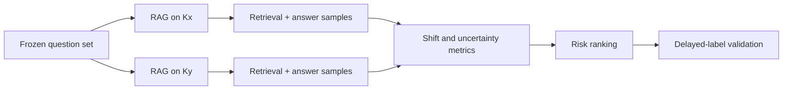

# Temporal RAG Drift Evaluation

> 지식베이스가 갱신된 뒤 RAG의 답변이 **달라졌는가**를 넘어, 그 변화가 **품질 저하 위험인가**를 라벨 없이 탐지하는 연구형 프로젝트입니다.

**Status:** Research prototype · Reproducibility package in progress

## 문제 정의

RAG 시스템은 문서가 추가·수정되면 검색 결과와 답변 분포가 함께 변합니다. 하지만 실제 운영에서는 새 정답 라벨을 즉시 얻기 어렵기 때문에 단순한 분포 변화만으로 품질 저하를 단정할 수 없습니다.

이 프로젝트는 동일 질문을 두 지식 스냅샷 `Kx`, `Ky`에 반복 질의하여 다음을 구분하는 평가 절차를 설계합니다.

- 새 지식을 반영한 정상적인 변화
- 검색 실패나 근거 약화로 발생한 유해한 변화
- 라벨이 생기기 전 우선 검토해야 할 고위험 질문

## 내가 주도한 부분

- 문제를 `distribution shift`가 아닌 `harmful drift risk` 탐지로 재정의
- 지식 스냅샷과 질문 집합을 고정하는 비교 실험 설계
- 다중 샘플 답변 분포와 검색 결과를 함께 기록하는 평가 흐름 설계
- 프록시 지표와 실제 오류 라벨을 분리하고, 사후 라벨로 탐지력을 검증하는 기준 수립
- 평균 점수만이 아니라 AUROC, F1, Risk Lift, McNemar 검정과 캘리브레이션을 포함한 평가안 정리

## 평가 파이프라인

## 검토한 신호

| 관점 | 후보 지표 | 해석 |
|---|---|---|
| 생성 불확실성 | token log-probability, Semantic Entropy | 답변 내부의 불확실성 |
| 의미 변화 | embedding centroid shift, Semantic Volume | 답변 의미 공간의 이동·확산 |
| 분포 변화 | KS distance, Energy Distance, Cluster-JS | 두 스냅샷의 출력 분포 차이 |
| 검색 변화 | 문서 중첩률, 순위 변화, 근거 일치성 | 생성 이전 단계의 변화 |

> 변화량은 오류 자체가 아닙니다. 이 프로젝트의 핵심은 각 신호가 실제 실패를 얼마나 잘 선별하는지 사후 라벨로 검증하는 것입니다.

## 현재 한계

- 즉시 사용 가능한 gold label이 없어 초기 단계는 위험도 프록시를 다룹니다.
- 데이터셋·모델별 임계값 일반화는 아직 검증이 필요합니다.
- 공개 가능한 원문 데이터와 실행 코드의 재현 패키지를 정리 중입니다.

## 다음 구현 목표

- [ ] 질문·문서 스냅샷 버전 관리
- [ ] `PostgreSQL + pgvector` 기반 실행 이력 저장
- [ ] 질문 단위 temporal split과 누수 방지 테스트
- [ ] Docker 실행 환경과 CI 테스트
- [ ] 위험 임계값 캘리브레이션 및 rollback gate
- [ ] OpenTelemetry 기반 검색·생성 추적

자세한 학습 계획은 [LEARNING_ROADMAP.md](docs/LEARNING_ROADMAP.md)에 정리했습니다.

## 개발 방식

AI 코딩 도구를 구현과 디버깅에 활용했습니다. 문제 정의, 실험 설계, 평가 기준, 결과 해석과 최종 의사결정은 직접 주도했습니다. 이후 공개되는 코드는 테스트와 재현 절차로 검증 가능하게 만드는 것을 원칙으로 합니다.

