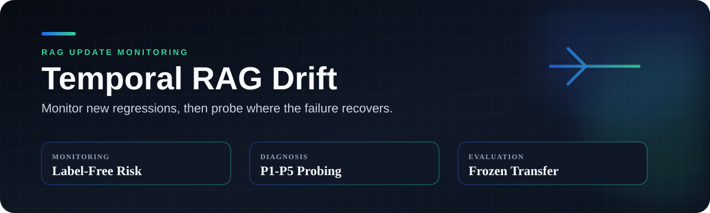

**지식 DB가 바뀐 직후, 새 정답지 없이 성능 저하가 의심되는 질문을 찾고 실패 구간을 좁힙니다.**

[결과](#결과) · [설계](#설계) · [실행](#실행) · [상세 문서](#상세-문서)

## 문제

RAG의 지식 DB가 업데이트되면 일부 질문은 최신 정보에 맞게 바뀌지만, 일부는 이전 답을 유지하거나 새 근거를 제대로 쓰지 못합니다. 운영 환경에서는 업데이트할 때마다 모든 질문의 최신 정답을 다시 만들기 어렵습니다.

이 프로젝트는 업데이트 전후의 답변 분포만 보고 새롭게 저하될 가능성이 높은 질문의 검토 순위를 만듭니다. 탐지한 질문에는 근거 제공 방식을 단계적으로 바꾸는 probe를 적용해 retrieval, ranking, context, evidence utilization 중 어디부터 확인할지 좁힙니다.

## 설계

~~~mermaid
flowchart LR
    A["Knowledge snapshots Kx and Ky"] --> B["BM25 + BGE hybrid retrieval"]
    B --> C["16 answer samples per condition"]
    C --> D["Shift + uncertainty features"]
    D --> E["T0-frozen detector"]
    E --> F["Risk-ranked questions"]
    F --> G["P1-P5 evidence probe"]
~~~

| 선택 | 이유 |
|---|---|
| BM25 + BGE + RRF | 날짜와 고유명사는 lexical search로 찾고, 표현이 다른 근거는 dense retrieval로 보완했습니다. 서로 다른 점수 대신 순위를 합쳤습니다. |
| 답변 분포 비교 | 생성 한 번의 우연을 줄이기 위해 조건마다 16개 답변을 만들고 semantic shift와 uncertainty 변화를 계산했습니다. |
| T0-frozen detector | 미래 label을 보고 기준을 다시 맞추지 않도록 detector와 threshold를 초기 구간에서 고정했습니다. |
| P1-P5 probe | 최신 근거의 포함 여부, 순위, 주변 문맥을 한 단계씩 바꿔 다음 조사 대상을 정했습니다. |

처음에는 shift와 uncertainty가 모두 높으면 위험할 것으로 예상했습니다. 실제로는 uncertainty가 낮은 confident failure도 있었고, 최신 정보에 정상 적응해 shift가 커진 경우도 있었습니다. 단순 사분면 규칙을 버리고 두 축의 상호작용을 학습하는 quadratic logistic으로 바꿨습니다.

## 결과

CLARK-News에서 T0 이후 처음 등장한 질문만 모아 future question-disjoint cohort를 만들었습니다. Detector와 threshold는 이 구간에서 다시 학습하지 않았습니다.

| N | New degradation | AUROC | AUPRC | Precision | Recall | F1 | Risk lift |
|---:|---:|---:|---:|---:|---:|---:|---:|
| 186 | 28 | **0.854** | 0.433 | 0.541 | **0.714** | **0.615** | **3.59x** |

Risk lift 3.59x는 detector가 고른 검토 집합에 새 저하 사례가 전체 평균보다 3.59배 많이 모였다는 뜻입니다. 오류를 자동 확정하는 점수가 아니라, 제한된 검토 시간을 어디에 먼저 쓸지 정하는 결과입니다.

별도의 과거 failure cohort에서는 natural retrieval로 다시 실패한 18건이 direct fact card 조건까지 모두 복구됐습니다. 이 probe 결과는 원인을 증명하지 않지만, retriever보다 evidence 전달과 활용을 먼저 점검해야 하는 사례를 가려냈습니다.

## 실행

~~~powershell
python -m venv .venv
.\.venv\Scripts\python.exe -m pip install -r requirements.txt
.\.venv\Scripts\python.exe -m unittest discover -s tests -p "test_*.py"
.\.venv\Scripts\python.exe scripts\run_experiment.py --config configs\mini_temporal_mock.yaml
~~~

Mini config는 실행 경로를 확인하는 synthetic smoke test입니다. 전체 CLARK 실험에는 원천 데이터와 외부 모델 또는 API가 필요합니다.

## 상세 문서

- [Methods](docs/METHODS.md): metric, detector, temporal protocol
- [Results](docs/RESULTS.md): 전체 결과와 bootstrap interval
- [Reproducibility](docs/REPRODUCIBILITY.md): 실행 순서와 필요한 artifact
- [CLARK data pipeline](docs/CLARK_DATA_PIPELINE.md): 시간에 따른 DB 변경을 재현한 데이터 구성
- [Limitations](docs/LIMITATIONS.md): 해석 범위

결과는 CLARK에서 구성한 시간축과 공개한 retrieval, model, prompt 조건에 한정합니다. Risk score는 개별 답변의 정답 확률이 아니며, probe의 최초 복구 단계도 인과적으로 확인한 root cause는 아닙니다.
