<div align="center">

# CLARK Temporal RAG Drift Detection

**Detecting newly degraded questions after cumulative news-database updates**


</div>


## TL;DR

When a cumulative news database changes from `Kx` to `Ky`, the same fixed RAG
agent is queried 16 times at each snapshot. A frozen detector uses the movement
and uncertainty of the two answer distributions to rank questions at risk of a
new accuracy drop.

| Item | This repository |
|---|---|
| Dataset | CLARK temporal questions, answer-validity spans, timestamped news evidence |
| Retrieval | SQLite FTS5 BM25 + BGE dense retrieval + reciprocal-rank fusion |
| Detector input | 2 normalized axes: answer-distribution shift and uncertainty change |
| Calibration | T0 update only: 2021-12-22 to 2022-08-31 |
| Locked evaluation | Four later cumulative-news updates, no detector retraining |
| Confirmatory result | **AUROC 0.854, recall 0.714, F1 0.615, risk lift 3.59x** |
| Diagnostic extension | P1-P5 evidence ladder for failure localization |

The method is a **relative degradation-risk monitor**. It does not certify the
absolute correctness of a single unseen answer.

## Research Question

> After a RAG database update, can answer-distribution changes identify which
> questions newly lose performance, without using current gold answers as
> detector inputs?

Gold answers are used offline to define and evaluate new degradation. They are
not passed to the frozen detector during future inference.

## End-to-End Flow

```mermaid
flowchart LR
    A["CLARK questions + answer validity spans"] --> B["Timestamped article linkage"]
    B --> C["Cumulative snapshots Kx and Ky"]
    C --> D["BM25 + BGE + RRF top-k"]
    D --> E["Fixed RAG agent: 16 samples per snapshot"]
    E --> F["BGE embeddings + DeBERTa NLI clusters"]
    F --> G["Shift score + uncertainty score"]
    G --> H["T0-frozen quadratic logistic detector"]
    H --> I["Future risk ranking"]
    I --> J["P1-P5 probe for flagged cases"]
```



## Detector

For each question, the pipeline produces answer sets `Ax` and `Ay` from the old
and updated cumulative news snapshots.

**Shift score** is the mean T0 empirical percentile of:

- Sliced Wasserstein distance
- RBF-MMD
- Energy distance
- semantic-cluster JS divergence
- centroid gap

**Uncertainty score** is the mean T0 empirical percentile of:

- change in semantic entropy
- change in semantic volume

A quadratic logistic model and operating threshold are fitted on T0 and then
frozen. The confirmatory threshold was `0.784043`.

## Main Result

| Evaluation cohort | N | New degradation | AUROC | AUPRC | Precision | Recall | F1 | Risk lift |
|---|---:|---:|---:|---:|---:|---:|---:|---:|
| Future question-disjoint confirmatory | 186 | 28 | **0.854** | 0.433 | 0.541 | **0.714** | **0.615** | **3.59x** |
| All future primary cases | 320 | 60 | 0.870 | 0.539 | 0.592 | 0.750 | 0.662 | 3.16x |

The detector was never refitted on the four future updates. Performance varies
by interval, so this is evidence for transfer within the measured CLARK regime,
not a universal RAG failure detector.

Raw tables: [`results/clark_t0/`](results/clark_t0/)  
Detailed interpretation: [`docs/RESULTS.md`](docs/RESULTS.md)

## Failure Probe

Flagged historical cases were replayed with progressively stronger evidence:

```text
P1 natural top-k
P2 guarantee current support is present
P3 move current support to rank 1
P4 provide decisive evidence only
P5 provide a compact fact card
```


Across 84 questions, all 18 new-degradation cases that failed at P1 recovered
by P5. The earliest recovery stage provides a diagnostic candidate for coverage,
ranking, context complexity, or evidence-utilization failure. It is not treated
as definitive causal proof.

## Repository Structure

```text
assets/                  two portfolio figures
configs/                 CLARK examples and archived experiment configs
data/                    setup instructions + synthetic smoke fixture
docs/                    methods, results, reproduction, limitations
results/clark_t0/        frozen temporal-transfer tables
results/probe/           P1-P5 probe tables
scripts/                 CLARK preparation, retrieval, detector and probe code
src/                     shared RAG generation, metric and retrieval modules
tests/                   focused CLARK and pipeline unit tests
```

## Quick Verification

```powershell
python -m venv .venv
.\.venv\Scripts\python.exe -m pip install -r requirements.txt
.\.venv\Scripts\python.exe -m unittest discover -s tests -p "test_*.py"
.\.venv\Scripts\python.exe scripts\run_experiment.py `
  --config configs\mini_temporal_mock.yaml
```

The smoke run uses invented data, mock generation, hashing embeddings and
heuristic NLI. It checks wiring only and is not a scientific result.

## Full CLARK Run

After obtaining CLARK data and building the local index:

```powershell
.\run_clark_t0_temporal_transfer_luna.cmd --stage prepare
.\run_clark_t0_temporal_transfer_luna.cmd --stage cost
.\run_clark_t0_temporal_transfer_luna.cmd --stage all --confirm-api-cost
```

See [`docs/REPRODUCIBILITY.md`](docs/REPRODUCIBILITY.md) for prerequisites and
[`docs/CLARK_DATA_PIPELINE.md`](docs/CLARK_DATA_PIPELINE.md) for the data path.

## Evidence Boundaries

- Third-party news articles and CLARK source files are not redistributed.
- API responses, model weights and local SQLite indexes are not committed.
- The 186-case confirmatory cohort contains 28 positive events.
- One future interval is materially weaker than the others.
- Absolute future accuracy cannot be inferred from the risk score alone.
- P1-P5 recovery stages are intervention-based diagnostic hypotheses.

## Portfolio Notes

- [Methods](docs/METHODS.md)
- [Results](docs/RESULTS.md)
- [Limitations](docs/LIMITATIONS.md)
- [Korean portfolio summary](docs/PORTFOLIO_SUMMARY_KO.md)
- [Learning & engineering roadmap](docs/LEARNING_ROADMAP.md)

## Contribution Statement

The project owner defined the research problem, selected the temporal protocol,
ran and audited experiments, and revised the claim around observed failures.
Codex was used substantially for implementation, debugging and documentation.
The available project history does not establish independent per-file authorship.
