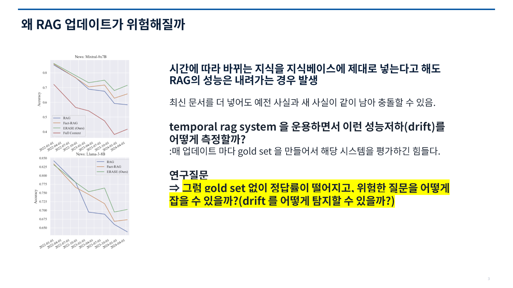
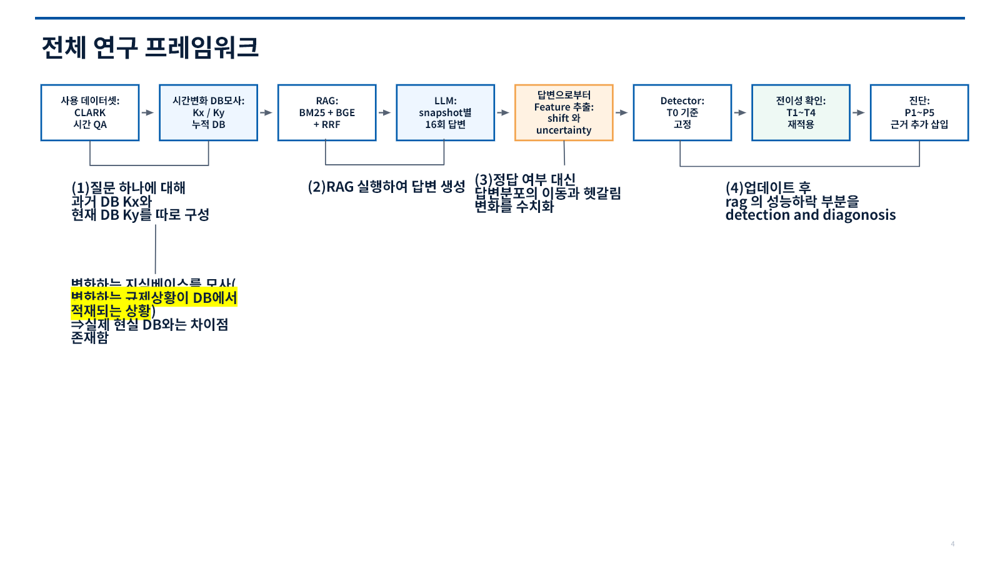
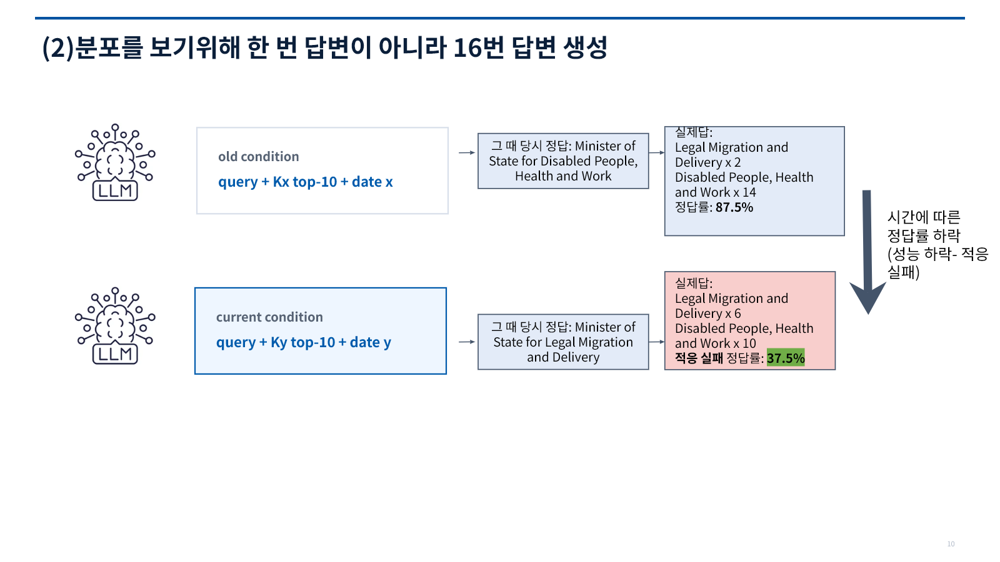
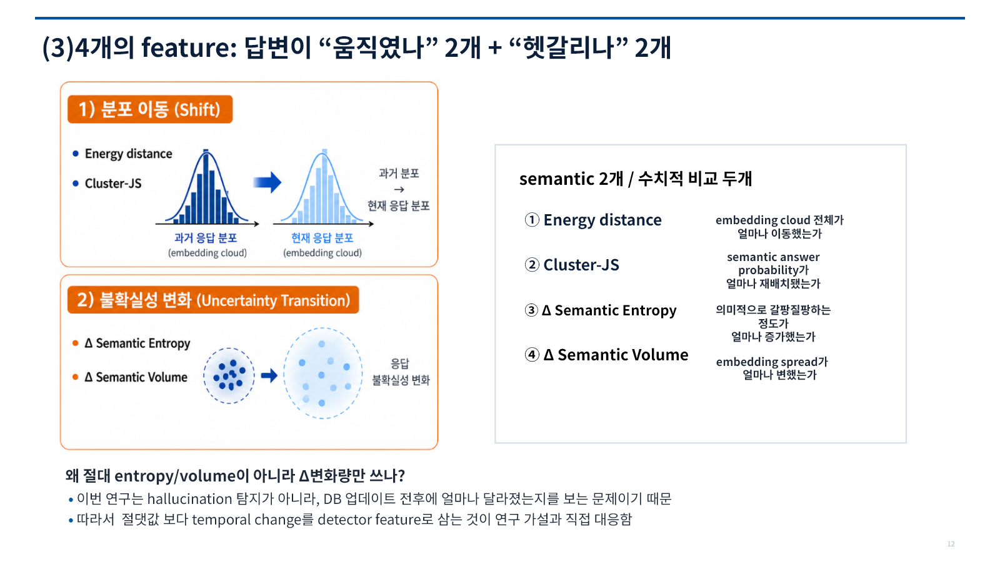
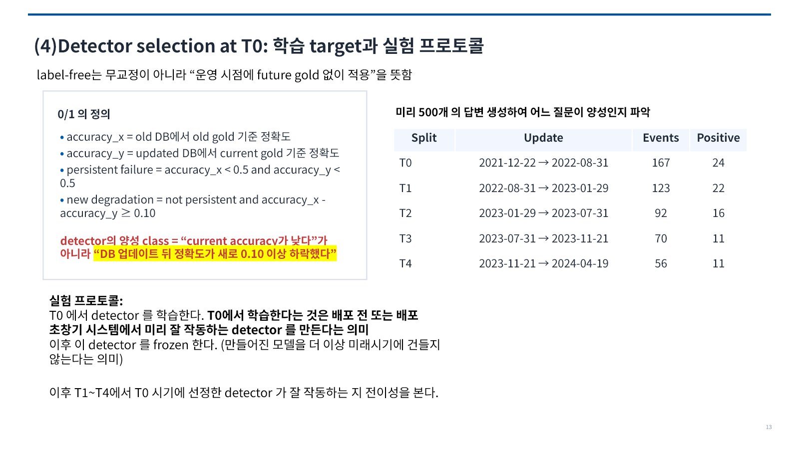
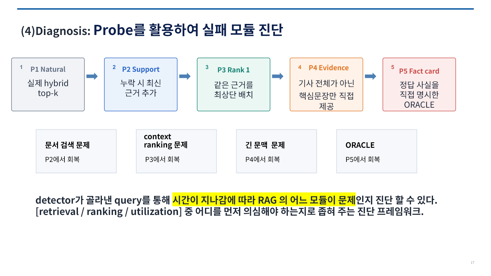

<div align="center">

[한국어](README.md) | [English](README_EN.md)

# Temporal RAG Failure Detection & Diagnosis

**누적 knowledge DB를 업데이트한 직후, 최신 gold answer 없이 query-level degradation risk를 순위화하고 evidence intervention으로 failure stage를 좁히는 framework입니다.**


[Problem](#1-problem-and-operating-setting) · [Method](#4-method) · [Results](#6-results-frozen-temporal-transfer) · [Diagnosis](#7-diagnosis-intervention-based-probing) · [Quick start](#9-quick-start) · [발표자료](TEMPORAL%20RAG%20FAILURE%20DETECTION.pptx)

</div>

## 1. Problem and operating setting

뉴스, 정책, 규정처럼 정답이 시간에 따라 바뀌는 지식에서는 문서를 최신화해도 RAG가 새 사실을 제대로 쓰지 못할 수 있습니다. 운영 DB에는 과거 문서가 남기 때문에 최신 evidence와 outdated evidence가 함께 검색됩니다. 그러면 같은 query의 answer distribution이 흔들리거나, 모델이 예전 답을 계속 고를 수 있습니다.

기존 temporal RAG 평가는 업데이트가 끝난 뒤 새 gold answer로 정확도를 계산하는 방식이 많습니다. 실제 운영에서는 DB를 갱신할 때마다 모든 질문의 최신 정답을 다시 만들기 어렵습니다. 이 프로젝트는 그 사이에 생기는 공백을 다룹니다. DB 업데이트 전후의 RAG behavior만 보고 새 성능 저하 가능성이 큰 질문을 먼저 고른 뒤, 사람이 볼 review queue를 만드는 것이 목표입니다.



이 프로젝트는 다음과 같은 배치형 운영 환경을 가정했습니다.

| 운영 조건 | 이 프로젝트의 가정 |
|---|---|
| DB 업데이트 | `Ky`는 새 DB로 교체한 상태가 아니라 `Kx`에 새 문서가 누적된 스냅샷입니다. |
| RAG 구성 | DB 업데이트의 영향만 보기 위해 검색기, 프롬프트와 생성 모델을 고정합니다. |
| 점검 질문 | 업데이트 전후에 같은 질문을 다시 실행할 수 있는 모니터링 질문 또는 회귀 테스트 묶음이 있습니다. |
| 최신 정답 | 운영 시점에는 모든 질문의 최신 gold answer가 없습니다. 과거 label은 초기 detector selection과 offline evaluation에만 사용합니다. |
| 관측 단위 | 질문별로 각 스냅샷에서 답변을 16회 생성해 한 번의 응답이 아니라 답변 분포를 비교합니다. |

따라서 이 detector는 처음 들어온 질문 하나의 정오를 실시간으로 판정하지 않습니다. DB 업데이트 전후를 모두 관측할 수 있는 질문을 대상으로, 어떤 질문부터 사람이 확인해야 하는지 순서를 정합니다. 여기서 `label-free`는 detector가 무학습이라는 뜻이 아니라, future update를 감시할 때 새 gold answer를 입력으로 쓰지 않는다는 뜻입니다.

## 2. Use cases in production

| 적용 장면 | 이 프로젝트가 제공하는 정보 |
|---|---|
| 뉴스, 정책, 규정 DB의 정기 업데이트 | 업데이트 뒤 위험도가 커진 질문을 정렬해 전체 질문 대신 상위 사례부터 검수할 수 있습니다. |
| 새 DB snapshot의 배포 전 점검 | alarm이 몰린 질문과 변화 양상을 보고 배포 전에 추가 확인할 범위를 정할 수 있습니다. |
| 장애 또는 품질 저하 triage | alarm query에 evidence를 단계적으로 바꿔 넣어 retrieval coverage, ranking, context complexity, evidence utilization 중 어디를 먼저 살펴볼지 좁힐 수 있습니다. |

운영에 적용한다면 DB ingestion이 끝난 뒤 monitoring query set을 `Kx`와 `Ky`에 다시 실행합니다. Detector는 degradation risk 순으로 review queue를 만들고, alarm case만 intervention probe로 넘깁니다.

출력은 두 가지입니다. 첫째는 질문별 상대 위험도와 검수 우선순위이고, 둘째는 근거 개입에서 처음 회복한 단계입니다. 자동 롤백이나 자동 수정은 구현 범위가 아닙니다. 회복 단계 역시 원인을 확정하는 값이 아니라 다음 점검 대상을 고르는 단서입니다.

## 3. Design rationale

| 설계 선택 | 이유 |
|---|---|
| 과거 문서가 남는 누적 `Kx`와 `Ky` 비교 | 운영 DB에서는 새 사실이 추가되어도 예전 사실이 함께 검색될 수 있기 때문입니다. |
| 스냅샷마다 16회 답변 생성 | 생성 모델의 우연한 한 번을 실패로 오해하지 않고, 답변이 체계적으로 이동하거나 퍼지는지 보기 위해서입니다. |
| 이동량 2개와 불확실성 변화 2개를 함께 사용 | 답이 크게 바뀌면서 한 답으로 수렴하는 경우와, 답은 비슷하지만 흔들림이 커지는 경우를 모두 남기기 위해서입니다. |
| 첫 업데이트 `T0`에서 detector와 threshold를 고정 | 미래 업데이트의 최신 정답을 보고 model이나 alarm threshold를 다시 맞출 수 없는 운영 상황을 모사하기 위해서입니다. |
| 탐지 후 P1부터 P5까지 evidence intervention | Risk alarm만으로는 retrieval과 generation 중 어느 부분을 확인해야 할지 알 수 없기 때문입니다. |

## 4. Method

CLARK의 time-valid QA를 누적 news snapshot으로 재구성하고, 같은 query를 `Kx`와 `Ky`에서 반복 실행합니다. 각 snapshot의 answer distribution에서 Core4 feature를 계산한 뒤 `T0`에서 detector와 threshold를 선택합니다. 이후 `T1`부터 `T4`까지는 refitting 없이 그대로 적용합니다.



### 4.1 Answer distribution sampling

생성 모델의 답은 같은 입력에서도 달라질 수 있습니다. 한 번의 응답만 비교하면 sampling noise를 실제 drift로 오해할 수 있어, snapshot마다 같은 query에 16개의 답변을 생성했습니다. 아래 사례처럼 DB 시점이 바뀐 뒤 정답률뿐 아니라 답변이 어느 후보로 모이는지도 달라집니다.



### 4.2 Core4 features

Core4는 단순 confidence score가 아닙니다. Embedding geometry와 semantic cluster probability를 함께 사용해 answer distribution의 이동과 불확실성 변화를 측정합니다.

```text
Shift               = Energy distance + cluster JS divergence
Uncertainty change  = Δ semantic entropy + Δ semantic volume
```



처음에는 shift와 uncertainty를 높고 낮음으로 나눈 단순 rule을 검토했습니다. 실제 데이터에는 크게 이동했지만 한쪽 오답으로 수렴해 uncertainty가 낮아지는 `confident-wrong` case도 있었습니다. 그래서 네 feature를 이분화하지 않고 그대로 사용해 여러 classifier family를 비교했습니다.

## 5. Experimental protocol

`T0`는 deployment 전 calibration 또는 초기 운영 구간에 해당합니다. T0에서 normalization, model family, hyperparameter와 alarm threshold를 선택한 뒤 모두 freeze했습니다. 미래 update인 `T1`부터 `T4`에는 새 label을 보지 않고 동일한 detector를 적용했습니다.



| 항목 | 설정 |
|---|---|
| 데이터 | CLARK 자연어 시간 질의와 정답 유효 기간 |
| DB 스냅샷 | 해당 시점까지 발행된 뉴스 기사 누적 |
| 검색 | SQLite FTS5 BM25 + `BAAI/bge-large-en-v1.5` + RRF |
| 답변 생성 | `gpt-5.6-luna`, temperature 0.8, top-p 0.95, 조건별 16회 |
| 의미 분석 | BGE 답변 임베딩 + `microsoft/deberta-large-mnli` 군집화 |
| 성능 저하 정의 | 업데이트 뒤 정확도가 0.10 이상 하락한 사례. 두 시점 모두 실패한 사례는 양성에서 제외 |

## 6. Results: frozen temporal transfer

Model family, representation, hyperparameter와 alarm threshold는 첫 업데이트 `T0`만 보고 정했습니다. 이후 네 update에는 retraining이나 threshold tuning 없이 적용했습니다.

| 구간 | DB 업데이트 | 사례 수 | 새 성능 저하 |
|---|---|---:|---:|
| T0 선택 구간 | 2021-12-22 → 2022-08-31 | 167 | 24 |
| T1 평가 | 2022-08-31 → 2023-01-29 | 123 | 22 |
| T2 평가 | 2023-01-29 → 2023-07-31 | 92 | 16 |
| T3 평가 | 2023-07-31 → 2023-11-21 | 70 | 11 |
| T4 평가 | 2023-11-21 → 2024-04-19 | 56 | 11 |

T1부터 T4까지의 341건과 성능 저하 60건을 합쳐 고정 전이 성능을 확인했습니다.

| 모델 | T0에서 선택된 정규화 | 미래 AUROC | AUPRC | 재현율 | F1 | 위험도 향상 |
|---|---|---:|---:|---:|---:|---:|
| L2 로지스틱 | robust-z | **0.883** | 0.617 | 0.833 | 0.645 | 2.99배 |
| 2차 로지스틱 | robust-z | 0.860 | 0.558 | 0.817 | **0.649** | 3.06배 |
| Additive GAM | robust-z | 0.853 | 0.531 | 0.800 | 0.640 | **3.03배** |
| Extra Trees | robust-z | 0.867 | 0.534 | 0.783 | 0.631 | 3.00배 |
| RBF-SVM | ECDF | 0.865 | **0.664** | 0.733 | 0.599 | 2.87배 |

T0 F1 기준의 공식 selection winner는 Extra Trees입니다. Future split에서는 L2 logistic의 AUROC와 quadratic logistic의 F1이 가장 높았습니다. 다만 상위 모델의 cluster bootstrap interval이 겹쳤기 때문에 한 classifier가 항상 우월하다고 해석하지 않았습니다. 이어지는 diagnosis experiment에는 feature별 risk curve를 확인할 수 있고 frozen transfer 성능도 비슷한 Additive GAM을 post-hoc으로 선택했습니다.


3차원 표면은 4차원 GAM을 2개의 해석 축으로 보인 직접 단면입니다. 이동량 축은
robust-z Energy와 JS를, 불확실성 변화 축은 robust-z 엔트로피 변화와 부피
변화를 같이 움직입니다. 색 표면은 T0의 변수 쌍 내 중앙 차이를 고정해 계산했고,
점의 높이는 각 질문의 실제 4차원 GAM 위험 확률입니다.


구간별 그림의 빨간 점은 새 성능 저하, 청록색 점은 그 밖의 사례,
검은 테두리는 실제 4차원 경보를 뜻합니다. [L2 로지스틱](assets/clark_core4_l2_robust_z_transfer.png)과
[2차 로지스틱](assets/clark_core4_quadratic_robust_z_transfer.png) 단면도 함께 공개했습니다.

## 7. Diagnosis: intervention-based probing

Detector가 찾은 위험 질문만으로는 failure mechanism을 알 수 없습니다. 같은 query에 들어가는 evidence를 P1부터 P5까지 한 단계씩 바꾸고, 어느 intervention에서 answer가 처음 회복되는지 확인했습니다. 이 방식은 root cause를 확정하는 causal diagnosis가 아니라, 다음에 확인할 RAG stage를 좁히는 triage입니다.



Additive GAM은 미래 341건 가운데 실제 성능 저하 60건 중 48건을 경보로 잡았습니다. 탐지에서 끝내지 않고, 양성 60건과 거짓 경보 42건, 크기를 맞춘 정상 대조군 42건을 다시 실행했습니다. 총 144건에서 11,520개의 답변을 생성했습니다.

| 단계 | 근거를 바꾼 방법 | 이 단계에서 회복할 때 먼저 의심할 부분 |
|---|---|---|
| P1 | 원래 검색 결과 | 기준 상태 |
| P2 | 최신 정답 근거가 상위 10개 안에 들도록 보장 | 검색 범위 |
| P3 | 최신 정답 근거를 1순위로 이동 | 순위와 위치 |
| P4 | 결정적인 근거만 제공 | 정보 추출 또는 복잡한 문맥 |
| P5 | 현재 사실을 짧은 카드로 제공 | 근거 활용과 답변 생성 |


실제 성능 저하 60건 중 48건이 경보에 걸렸습니다. 이 가운데 5건은 P1에서 실패가 다시 나타나지 않았고, 나머지 43건은 경보에 걸린 뒤 어느 단계에서든 회복했습니다. P5에는 현재 정답 사실이 직접 들어가므로 `43/60`, 71.7%는 진단 가능성의 상한으로 해석했습니다. 운영 환경의 위치 추정률로 사용할 수는 없습니다. P5 이전의 P2부터 P4에서 회복한 사례는 11건이었습니다.


최신 정답 근거가 원래 검색 상위 10개에 있었던 양성 사례가 60건 중 52건이었지만, 재현된 성능 저하는 주로 P4 또는 P5에서 처음 회복했습니다. 이 결과는 이 조건에서 근거 추출과 활용을 먼저 살펴볼 필요가 있음을 보여줍니다. 개입 단계는 점검 후보를 좁히는 방법이며 하나의 원인을 인과적으로 증명하지는 않습니다.

## 8. Repository structure

```text
assets/                     탐지기 단면과 근거 개입 결과 그림
configs/actual/             민감정보를 뺀 실제 실험 설정
data/                       합성 예제와 CLARK 준비 안내
docs/                       방법, 데이터 파이프라인, 결과와 한계
results/clark_t0/           초기 2축 기준 실험
results/core4_ml/           Core4 모델 선택과 고정 전이 결과
results/detector_linked_probe/ 탐지 연계 근거 개입 집계
scripts/                    검색, 생성, 탐지와 근거 개입 실행 코드
src/                        공통 RAG, 임베딩, 군집화와 지표 모듈
tests/                      단위 테스트와 합성 파이프라인 테스트
```

CLARK 원문 질문과 기사, 사례별 예측, 답변 로그, 모델 가중치, API 인증 정보와 SQLite 인덱스는 공개하지 않았습니다.

## 9. Quick start

```powershell
python -m venv .venv
.\.venv\Scripts\python.exe -m pip install -r requirements.txt
.\.venv\Scripts\python.exe -m unittest discover -s tests -p "test_*.py" -v
.\.venv\Scripts\python.exe scripts\run_experiment.py --config configs\mini_temporal_mock.yaml
.\.venv\Scripts\python.exe scripts\check_public_artifact.py
```

이 실행은 직접 만든 합성 데이터와 모의 구성 요소로 파이프라인 연결을 확인합니다. 위 연구 결과를 재현하는 실행은 아닙니다. 전체 재현에는 라이선스를 지켜 준비한 CLARK 원자료와 로컬 DB 스냅샷이 필요합니다. 자세한 내용은 [재현 안내](docs/REPRODUCIBILITY.md)와 [CLARK 데이터 파이프라인](docs/CLARK_DATA_PIPELINE.md)에 정리했습니다.

## 10. Limitations

- 정답은 오프라인 라벨 생성과 평가에만 사용했습니다. 미래 탐지기의 입력에는 넣지 않았습니다.
- Core4 미래 341건과 초기 186건 실험은 서로 다른 평가 집합이므로 직접적인 성능 향상으로 비교하지 않습니다.
- 탐지기는 업데이트 전후의 상대 위험을 추정합니다. 처음 보는 답변 하나의 정오를 판정하지 않습니다.
- 결과는 이 저장소에서 사용한 CLARK, 검색기, 생성 모델과 프롬프트 조건에서 확인했습니다.
- 근거 개입에서의 회복은 점검 후보를 제시할 뿐, 하나의 원인을 확정하지 않습니다.

CLARK 출처: [Language Modeling with Editable External Knowledge](https://aclanthology.org/2025.findings-naacl.168/)
