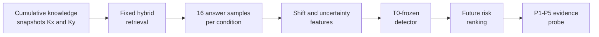

<div align="center">

**DB 업데이트 이후 새롭게 실패했을 가능성이 높은 RAG 질문을 라벨 없이 탐지하고, evidence intervention으로 조사할 구간을 좁히는 평가 프레임워크**


[문제와 목표](#문제와-목표) · [방법](#방법) · [검증 결과](#검증-결과) · [실행](#실행) · [해석 범위](#해석-범위)

</div>

---

## 프로젝트 맥락

| 구분 | 내용 |
|---|---|
| 작업 형태 | 개인 연구 프로젝트 |
| 담당 | 연구 질문, temporal protocol, failure detector, intervention probe, 평가와 결과 해석 |
| 구현 방식 | Codex를 활용한 코드 작성·수정과 반복 검증 |
| 공개 범위 | 실행 코드, 테스트, 핵심 집계 결과와 재현 문서 |

저장소 이름에는 연구 초기에 사용한 `temporal-rag-drift`를 유지했습니다. 포트폴리오에서는 수행한 작업이 바로 드러나도록 **Temporal RAG Failure Detection**으로 표시합니다.

## 문제와 목표

실제 운영에서는 DB를 업데이트할 때마다 모든 질문의 최신 정답을 바로 만들기 어렵습니다. 이 때문에 업데이트 직후에는 전체 정확도를 계산할 수 없고 어떤 질문부터 확인해야 하는지도 알 수 없습니다.

이 프로젝트는 업데이트 전후 RAG의 행동 변화만으로 새 저하 가능성이 높은 질문의 검토 순위를 만들고, 탐지된 질문에는 evidence intervention을 적용해 retrieval, ranking과 context 구성, evidence utilization 중 먼저 조사할 구간을 좁힙니다. Gold answer는 detector 입력이 아니라 미래 구간의 탐지 결과를 사후 평가할 때만 사용했습니다.

## 방법



| 설계 | 선택 이유 |
|---|---|
| CLARK 누적 snapshot | 기존 문서는 남고 새 근거가 쌓이는 DB 업데이트를 같은 규칙으로 구성하기 위해 사용했습니다. 실제 서비스의 대리 환경이므로 결과는 이 시간축 실험에 한정합니다. |
| 조건별 답변 16회 | 한 번의 생성 결과에 좌우되지 않도록 embedding과 NLI로 답변 분포를 만들었습니다. SWD, RBF-MMD, Energy distance, semantic-cluster JS, centroid gap과 uncertainty 변화를 신호로 사용했습니다. |
| Quadratic logistic | 단순한 shift·uncertainty 사분면은 confident failure와 정상적인 answer shift를 안정적으로 나누지 못했습니다. 두 축의 상호작용과 곡률을 반영하되 결과를 해석할 수 있는 모델을 선택했습니다. |
| T0-frozen 평가 | 미래 label을 보고 기준을 다시 맞추지 않도록 detector와 threshold를 T0에서 정한 뒤 질문이 겹치지 않는 미래 네 구간에 그대로 적용했습니다. |
| P1-P5 probe | 최신 근거의 포함, 순위와 주변 문맥을 단계적으로 바꿔 최초 복구 지점을 기록했습니다. 이 지점은 확정 원인이 아니라 다음 조사 대상을 정하는 가설입니다. |

Retrieval은 SQLite FTS5 BM25와 BGE dense retrieval을 reciprocal-rank fusion으로 결합했습니다. 세부 정의와 설정은 [Methods](docs/METHODS.md)에 있습니다.

## 검증 결과

주요 결과는 T0 이후 처음 등장한 질문으로 구성한 confirmatory cohort입니다.

| Cohort | N | New degradation | AUROC | Recall | F1 | Risk lift |
|---|---:|---:|---:|---:|---:|---:|
| **Future question-disjoint confirmatory** | 186 | 28 | **0.854** | **0.714** | **0.615** | **3.59×** |

Risk lift `3.59배`는 detector가 고른 검토 집합에 새 저하 사례가 같은 cohort의 전체 발생률보다 더 밀집했다는 뜻입니다. 오류를 확정하는 도구가 아니라 제한된 검토 시간을 위험 질문에 먼저 쓰기 위한 결과입니다. 구간별 편차가 있었고 가장 약한 구간의 AUROC는 `0.658`이었습니다.

별도로 고정한 과거 failure cohort 22건에는 evidence probe를 적용했습니다. P1에서 다시 실패한 18건은 P5까지 모두 복구됐습니다. 이 22건은 위 confirmatory cohort의 새 저하 28건과 같은 표본이 아닙니다. 전체 결과와 bootstrap interval은 [Results](docs/RESULTS.md)에 있습니다.

## 실행

```powershell
python -m venv .venv
.\.venv\Scripts\python.exe -m pip install -r requirements.txt
.\.venv\Scripts\python.exe -m unittest discover -s tests -p "test_*.py"
.\.venv\Scripts\python.exe scripts\run_experiment.py --config configs\mini_temporal_mock.yaml
```

Smoke run은 실행 경로만 확인합니다. CLARK 실험 재현에는 라이선스가 허용된 원천 데이터와 외부 모델·API가 필요합니다. 전체 순서는 [Reproducibility](docs/REPRODUCIBILITY.md)와 [Data pipeline](docs/CLARK_DATA_PIPELINE.md)에 있습니다.

## 해석 범위

- risk score는 개별 답변의 정답 확률이 아닙니다.
- CLARK 밖의 데이터셋, 모델, prompt와 retriever에서도 같은 성능이 나온다고 주장하지 않습니다.
- probe의 최초 복구 단계는 인과적으로 증명된 root cause가 아닙니다.
- CLARK 원천 파일, 기사 본문, API 응답, 모델 가중치와 local index는 공개하지 않습니다.

## 기여

연구 질문, 가설, temporal protocol, 평가 기준, detector, failure probe와 결과 해석 범위를 설계했습니다. Codex를 활용해 실험 코드와 테스트를 반복 수정·검증했고, 공개 저장소에는 실행 코드와 핵심 집계표를 함께 두었습니다.

[Methods](docs/METHODS.md) · [Results](docs/RESULTS.md) · [Limitations](docs/LIMITATIONS.md) · [Reproducibility](docs/REPRODUCIBILITY.md)
