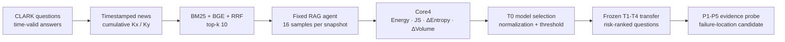

<div align="center">

[한국어](README.md) | [English](README_EN.md)

# Temporal RAG Failure Detection and Diagnosis

**Prioritize questions that may have newly degraded after a cumulative knowledge-base update, then narrow the inspection path with evidence interventions.**


</div>

Updating a news or policy knowledge base leaves a practical gap: current answers
may change before a new gold-answer set is ready. This project compares answer
distributions before and after the update to decide which questions need review
first. It then changes the evidence supplied to selected questions to identify
a candidate RAG stage for inspection.

The **T0-selected Core4 + Extra Trees detector flagged 89 of 341 future update
events and captured 47 of the 60 new degradations**. This tests whether the
detector can concentrate the review queue. The separate diagnostic extension
uses a post-hoc Additive GAM and benchmark-selected current evidence.

## Assumed operating setting

RAG systems that answer questions about news, policies, and regulations keep
both old and new documents. Adding current evidence does not guarantee that the
system will use it. Conflicting retrieval results can make an answer unstable
or leave the model anchored to an outdated fact.

This project models a batch monitoring workflow with the following conditions:

| Condition | Assumption |
|---|---|
| Database update | `Ky` is `Kx` plus newly available documents, not a clean replacement database. |
| RAG stack | The retriever, prompt, and generator stay fixed so the experiment isolates the database update. |
| Monitored questions | A replay or regression set can be run against both snapshots. |
| Current gold labels | They are unavailable during future monitoring. Historical labels are used only for initial selection and offline evaluation. |
| Observation unit | Each question produces 16 answers per snapshot so the detector can compare answer distributions. |

The detector does not judge the correctness of one unseen live response. It
ranks replayed questions by relative post-update degradation risk.

## Intended operating workflow

| Workflow | Output used by an operator |
|---|---|
| Periodic news, policy, or regulation updates | A risk-ranked review queue after each knowledge-base refresh. |
| Pre-release database checks | A smaller set of alarmed questions to inspect before promoting a new snapshot. |
| Failure triage | A candidate inspection stage covering retrieval coverage, ranking, context complexity, or evidence use. |

The intended batch flow runs the monitored questions against `Kx` and `Ky`
after ingestion. It builds a risk-ranked review queue and sends only alarmed
cases to the evidence probe.

The intended outputs are a review priority and a candidate inspection stage.
Review-time savings and automatic rollback or repair have not been evaluated.
The current probe uses benchmark-selected current evidence; an operational
version would also need a way to prepare that evidence from available logs
and documents.

## Why the design looks this way

The idea is to keep **where the answers move** separate from **how dispersed
they become**. A move toward the current answer and a confident move toward a
wrong answer can both produce large shifts. An answer distribution can also
stay near its old position while becoming less stable. Core4 retains both
shift and uncertainty change to represent these cases.

The detector and threshold are frozen at the first update, `T0`, because new
gold answers would not be available for refitting after each later update.
Evidence interventions follow detection because a risk score alone does not
specify which RAG stage to inspect.

The detector uses four temporal changes:

```text
Shift       = Energy distance + semantic-cluster JS divergence
Uncertainty = delta semantic entropy + delta semantic volume
```

## End-to-end design



| Layer | Fixed implementation |
|---|---|
| Dataset | CLARK natural-language temporal QA and answer-validity spans |
| Snapshot | `K_t =` articles timestamped at or before `t` |
| Retrieval | SQLite FTS5 BM25 + `BAAI/bge-large-en-v1.5` + reciprocal-rank fusion |
| Generation | `gpt-5.6-luna`, temperature 0.8, top-p 0.95, 16 samples per condition |
| Semantic analysis | BGE answer embeddings + `microsoft/deberta-large-mnli` clustering |
| Endpoint | `accuracy_x - accuracy_y >= 0.10`, excluding persistent failure from the positive class |

CLARK links time-valid answers to external news evidence, which makes it possible to construct historical `Kx` and cumulative `Ky` snapshots under one rule. It is a controlled proxy for a temporal knowledge update, not a reproduction of a specific production database. The result should therefore be interpreted within this experimental setting. See the [CLARK data pipeline](docs/CLARK_DATA_PIPELINE.md) for the construction procedure.

## Frozen temporal transfer

Model family, representation, hyperparameters and alarm threshold are selected
using only the first update, `T0: 2021-12-22 -> 2022-08-31`. They are then
applied without refitting to four later cumulative-news updates.

| Split | Update | Events | New degradation |
|---|---|---:|---:|
| T0 calibration | 2021-12-22 -> 2022-08-31 | 167 | 24 |
| T1 test | 2022-08-31 -> 2023-01-29 | 123 | 22 |
| T2 test | 2023-01-29 -> 2023-07-31 | 92 | 16 |
| T3 test | 2023-07-31 -> 2023-11-21 | 70 | 11 |
| T4 test | 2023-11-21 -> 2024-04-19 | 56 | 11 |

### Core4 model comparison

Nine classifier families and three T0-fitted normalizations were evaluated.
The table shows the T0 selection winner, the future metric leaders, and the
model used for diagnosis. Results are frozen T1-T4 estimates (`N=341`, 60
positive events); the complete candidate table is linked below.

| Model | Normalization | Future AUROC | AUPRC | Recall | F1 | Risk lift |
|---|---|---:|---:|---:|---:|---:|
| Elastic Net | robust-z | **0.886** | 0.642 | 0.833 | 0.633 | 2.90x |
| L2 logistic | robust-z | 0.883 | 0.617 | 0.833 | 0.645 | 2.99x |
| Quadratic logistic | robust-z | 0.860 | 0.558 | 0.817 | **0.649** | **3.06x** |
| Additive GAM | robust-z | 0.853 | 0.531 | 0.800 | 0.640 | 3.03x |
| Extra Trees | robust-z | 0.867 | 0.534 | 0.783 | 0.631 | 3.00x |
| RBF-SVM | ECDF | 0.865 | **0.664** | 0.733 | 0.599 | 2.87x |

Extra Trees had the highest T0 F1 and is the formal T0-selection winner.
In a retrospective comparison of the future splits, Elastic Net had the
highest AUROC, RBF-SVM the highest AUPRC, and quadratic logistic the highest
F1. Future labels were not used to reselect the deployed detector. The three
question-cluster bootstrap comparisons of GAM against L2 logistic, quadratic
logistic and Extra Trees each had a 95% F1-difference interval containing zero.
The results do not establish one universally superior classifier. For the
T0-selected Extra Trees detector, the degradation rate among alarms was
47/89 (52.8%), compared with 60/341 (17.6%) in the full cohort. This gives a
3.00x risk lift, with 42 false alarms and 13 missed degradations. Additive GAM is
retained for the diagnostic extension because its Core4 surface is inspectable
and its frozen performance is comparable; this choice is explicitly post-hoc.
The full candidate table and T0 selections are available in
[frozen_future_model_summary.csv](results/core4_ml/frozen_future_model_summary.csv).


The 3D surface is a direct slice of the four-dimensional GAM expressed through
two inspection axes. The shift axis moves robust-z Energy and JS together. The
uncertainty-change axis moves robust-z entropy and volume changes together.
The paired feature differences stay fixed at their T0 median values, while each
point is plotted at its actual four-dimensional GAM risk.


In the update panels, red points are new degradations, teal points are other
outcomes, and black rings show actual four-dimensional alarms. Additional
surfaces are provided for
[L2 logistic](assets/clark_core4_l2_robust_z_transfer.png) and
[quadratic logistic](assets/clark_core4_quadratic_robust_z_transfer.png).

## Detector-linked failure probe

The frozen Additive GAM screened all 341 future events:

| AUROC | AUPRC | Precision | Recall | F1 | Risk lift | TP / FP / FN / TN |
|---:|---:|---:|---:|---:|---:|---:|
| **0.853** | 0.531 | 0.533 | **0.800** | **0.640** | **3.03x** | 48 / 42 / 12 / 239 |

All 60 positive events, all 42 false positives, and 42 matched true-negative
controls were replayed through a blinded evidence ladder (`144` events,
`11,520` generated answers):

The screening confusion matrix and probe aggregates are available in
[screening_performance.csv](results/detector_linked_probe/screening_performance.csv)
and the [diagnostic report](results/detector_linked_probe/report_ko.md).

| Stage | Evidence intervention | Earliest recovery suggests |
|---|---|---|
| P1 | Natural top-k | Baseline |
| P2 | Current support guaranteed | Retrieval coverage sensitivity |
| P3 | Current support moved to rank 1 | Ranking/position sensitivity |
| P4 | Decisive evidence only | Extraction or context-complexity sensitivity |
| P5 | Compact current fact card | Evidence-utilization/answer-realization sensitivity |


The detector caught `48/60` historical new degradations. Five of those did not
reproduce at P1; the remaining `43/60` both triggered an alarm and reached a
recovery stage. P5 explicitly contains the current gold fact, so this 71.7%
end-to-end figure is an **oracle diagnostic upper bound**, not an operational
label-free localization rate. Before P5, only `11/60` positives recovered at
P2-P4 under benchmark-selected evidence interventions.


Most reproduced degradations first recovered at P4 or P5, even though latest
support was already present in natural top-k for `52/60` positives. This points
to evidence extraction/utilization as a major candidate in this setup, but the
probe stage is an intervention-based hypothesis rather than causal proof.

## Repository map

```text
assets/                     detector surfaces and probe figures
configs/actual/             sanitized archived experiment settings
data/                       synthetic smoke fixture and CLARK setup notes
docs/                       methods, data pipeline, results and limitations
results/clark_t0/           original two-axis confirmatory baseline
results/core4_ml/           Core4 T0 selection and frozen transfer summaries
results/detector_linked_probe/ aggregate screening and probe summaries
scripts/                    CLARK retrieval, generation, detector and probe code
src/                        shared RAG, embedding, clustering and metric modules
tests/                      focused unit and synthetic pipeline tests
```

Original CLARK questions, article text, case-level predictions, response logs,
model weights, API credentials and SQLite indexes are intentionally excluded.

## Quick verification

```powershell
python -m venv .venv
.\.venv\Scripts\python.exe -m pip install -r requirements.txt
.\.venv\Scripts\python.exe -m unittest discover -s tests -p "test_*.py" -v
.\.venv\Scripts\python.exe scripts\run_experiment.py --config configs\mini_temporal_mock.yaml
.\.venv\Scripts\python.exe scripts\check_public_artifact.py
```

The smoke run uses invented data and mock components. It verifies pipeline
wiring only; it does not reproduce the scientific result.

Full CLARK reproduction starts from licensed source data and prepared local
snapshots. See [Reproducibility](docs/REPRODUCIBILITY.md) and the
[CLARK data pipeline](docs/CLARK_DATA_PIPELINE.md).

## Evidence boundaries

- Gold answers are used for T0 fitting and selection, offline evaluation, and evidence preparation in the separate diagnostic experiment. They are never future detector inputs.
- Core4 is evaluated on questions whose correct answers change over time. Performance on an operational review set that also contains stable-answer questions needs further evaluation.
- The Core4 all-future endpoint and the earlier 186-case confirmatory endpoint are different cohorts and must not be compared as a direct improvement claim.
- The detector estimates relative update risk, not absolute answer correctness.
- Detector validity is demonstrated only for the measured CLARK model/retriever/prompt regime.
- Probe recovery stages do not establish a unique causal root cause.

## Source

CLARK source: [Language Modeling with Editable External Knowledge](https://aclanthology.org/2025.findings-naacl.168/).
